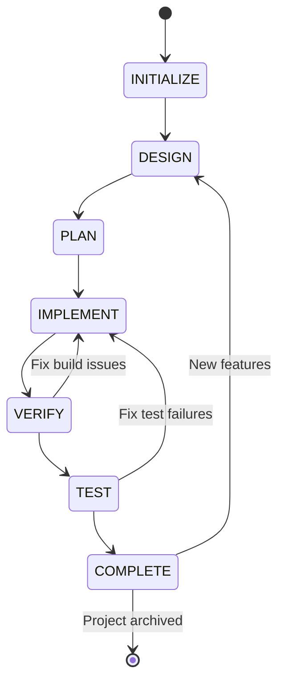

# Software Development Life Cycle (SDLC) - MANDATORY

## Overview
This document defines the MANDATORY Software Development Life Cycle for all CIM development. Every project MUST follow these phases in order, with clearly defined transitions and gates between phases.

## Project States

The following states represent the complete lifecycle of a CIM project:

1. **INITIALIZE** - Project setup and scaffolding
2. **DESIGN** - Architecture and design documentation
3. **PLAN** - Implementation planning and task breakdown
4. **IMPLEMENT** - Code development
5. **VERIFY** - Build and compilation verification
6. **TEST** - Testing and quality assurance
7. **COMPLETE** - Feature complete and production ready

## State Transition Map

### Valid State Transitions



### Transition Rules

| From State | Can Transition To | Conditions |
|------------|------------------|------------|
| INITIALIZE | DESIGN | Project structure created, .claude configured |
| DESIGN | PLAN | All design artifacts complete |
| PLAN | IMPLEMENT | Implementation plan approved, tasks defined |
| IMPLEMENT | VERIFY | Code implementation complete |
| VERIFY | TEST | Code compiles without errors |
| VERIFY | IMPLEMENT | Build failures require fixes |
| TEST | COMPLETE | All tests passing, coverage met |
| TEST | IMPLEMENT | Test failures require fixes |
| COMPLETE | DESIGN | New version/features planned |

### Invalid Transitions
- **PLAN → COMPLETE**: Cannot skip implementation
- **DESIGN → IMPLEMENT**: Cannot skip planning
- **INITIALIZE → IMPLEMENT**: Cannot skip design and planning
- **Any state → previous state**: Cannot move backwards (except COMPLETE → DESIGN for new versions)

## Phase Definitions and Gates

### 1. INITIALIZE Phase

**Purpose**: Set up project structure and development environment

**Entry Criteria**: 
- Project repository created
- Development environment available

**Activities**:
- Create directory structure
- Copy .claude configuration
- Initialize version control
- Create initial readme.md
- Set up progress tracking (progress.json)

**Exit Criteria** (Gate to DESIGN):
- [ ] .claude directory configured
- [ ] doc/progress/progress.json created
- [ ] readme.md with project overview
- [ ] Git repository initialized
- [ ] All files added to git

**Artifacts**:
- Project directory structure
- .claude configuration
- Initial progress.json
- readme.md

### 2. DESIGN Phase

**Purpose**: Define architecture, interfaces, and system design

**Entry Criteria**:
- INITIALIZE phase complete
- Clear understanding of requirements

**Activities**:
- Create architecture diagrams
- Define domain model
- Design event flows
- Specify APIs and interfaces
- Document design decisions

**Exit Criteria** (Gate to PLAN):
- [ ] Architecture diagrams in doc/design/
- [ ] Domain model documented
- [ ] Event flow diagrams created
- [ ] API specifications written
- [ ] Design review completed

**Artifacts**:
- `doc/design/architecture.md`
- `doc/design/domain-model.md`
- `doc/design/event-flows.md`
- `doc/design/api-specification.md`
- Mermaid diagrams for all major components

### 3. PLAN Phase

**Purpose**: Break down implementation into manageable tasks

**Entry Criteria**:
- DESIGN phase complete
- All design artifacts reviewed

**Activities**:
- Create task breakdown structure
- Identify dependencies
- Estimate effort
- Define test strategy
- Plan implementation sequence

**Exit Criteria** (Gate to IMPLEMENT):
- [ ] Task breakdown in progress.json
- [ ] Dependencies documented
- [ ] Test strategy defined
- [ ] Implementation sequence planned
- [ ] Resource requirements identified

**Artifacts**:
- Updated progress.json with task nodes
- `doc/plan/implementation-plan.md`
- `doc/plan/test-strategy.md`
- `doc/plan/dependencies.md`

### 4. IMPLEMENT Phase

**Purpose**: Write code following TDD principles

**Entry Criteria**:
- PLAN phase complete
- Development environment ready
- Dependencies available

**Activities**:
- Write failing tests first (TDD)
- Implement code to pass tests
- Follow CIM patterns (event-driven, no CRUD)
- Create necessary structs, traits, and functions
- Document code

**Exit Criteria** (Gate to VERIFY):
- [ ] All planned features implemented
- [ ] Code follows project standards
- [ ] Tests written for all features
- [ ] Code documentation complete
- [ ] All files added to git

**Artifacts**:
- Source code files
- Test files
- Updated Cargo.toml
- Code documentation

### 5. VERIFY Phase

**Purpose**: Ensure code compiles and builds correctly

**Entry Criteria**:
- IMPLEMENT phase complete
- All code committed to git

**Activities**:
- Run `cargo build`
- Fix compilation errors
- Resolve dependency issues
- Check for warnings
- Verify build artifacts

**Exit Criteria** (Gate to TEST):
- [ ] `cargo build` succeeds
- [ ] No compilation errors
- [ ] Dependencies resolved
- [ ] Critical warnings addressed
- [ ] Build reproducible

**Artifacts**:
- Clean build output
- Resolved dependency tree
- Build logs

### 6. TEST Phase

**Purpose**: Validate functionality and quality

**Entry Criteria**:
- VERIFY phase complete
- Code builds successfully

**Activities**:
- Run unit tests
- Run integration tests
- Check test coverage
- Performance testing
- Documentation testing

**Exit Criteria** (Gate to COMPLETE):
- [ ] All tests passing (`cargo test`)
- [ ] Test coverage ≥80%
- [ ] Integration tests passing
- [ ] Performance benchmarks met
- [ ] No critical bugs

**Artifacts**:
- Test results
- Coverage reports
- Performance benchmarks
- Bug reports (if any)

### 7. COMPLETE Phase

**Purpose**: Finalize for production readiness

**Entry Criteria**:
- TEST phase complete
- All tests passing

**Activities**:
- Final documentation review
- Security audit
- Performance optimization
- Prepare release notes
- Update version numbers

**Exit Criteria**:
- [ ] All documentation updated
- [ ] Security review passed
- [ ] Performance acceptable
- [ ] Release notes written
- [ ] Version tagged in git

**Artifacts**:
- Final documentation
- Release notes
- Security audit report
- Tagged release

## Mandatory Pre-Action Checks

Before ANY action, you MUST:

1. **Check Current State**:
   ```bash
   # Read current state from progress.json
   cat doc/progress/progress.json | jq '.current_phase'
   ```

2. **Verify State Transition is Valid**:
   - Check the transition map above
   - Ensure all exit criteria for current phase are met

3. **Check Phase-Specific Requirements**:
   - Review the exit criteria checklist
   - Ensure all artifacts exist

4. **Update Progress Before Proceeding**:
   ```bash
   # Capture system date
   CURRENT_DATE=$(date -I)
   # Update progress.json with new state
   ```

## State Tracking

Each module's progress.json MUST include:

```json
{
  "current_phase": "DESIGN|PLAN|IMPLEMENT|VERIFY|TEST|COMPLETE",
  "phase_history": [
    {
      "phase": "INITIALIZE",
      "entered": "2025-01-01",
      "exited": "2025-01-02",
      "completed_by": "git-hash"
    }
  ],
  "phase_artifacts": {
    "DESIGN": {
      "architecture_diagram": true,
      "domain_model": true,
      "event_flows": false,
      "api_specification": false
    }
  }
}
```

## Enforcement

This SDLC is MANDATORY. You MUST:

1. Always check current state before any action
2. Never skip phases
3. Complete all exit criteria before transitioning
4. Document all transitions in progress.json
5. Create all required artifacts for each phase

## Common Violations to Avoid

1. **Creating code files in DESIGN phase** - Wait for IMPLEMENT
2. **Writing implementation before tests** - Follow TDD
3. **Skipping PLAN phase** - Always break down work first
4. **Moving to COMPLETE without all tests** - Tests are mandatory
5. **Not updating progress.json** - Track every transition

## Quick Reference

```bash
# Check current phase
cat doc/progress/progress.json | jq '.current_phase'

# Validate next transition
# If current_phase is "DESIGN", can only go to "PLAN"
# If current_phase is "PLAN", can only go to "IMPLEMENT"
# etc.
```

Remember: This SDLC ensures quality and prevents premature implementation. Follow it strictly.