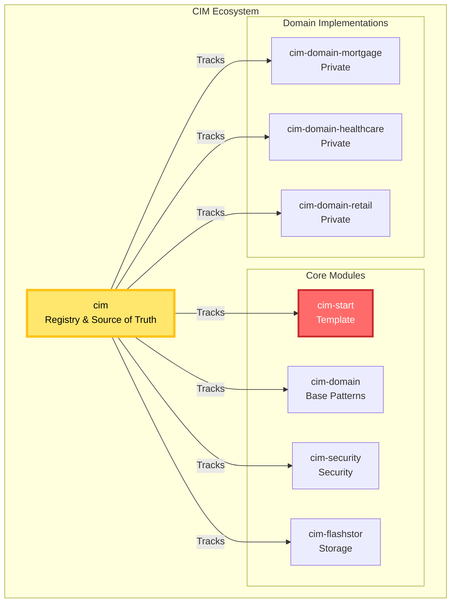
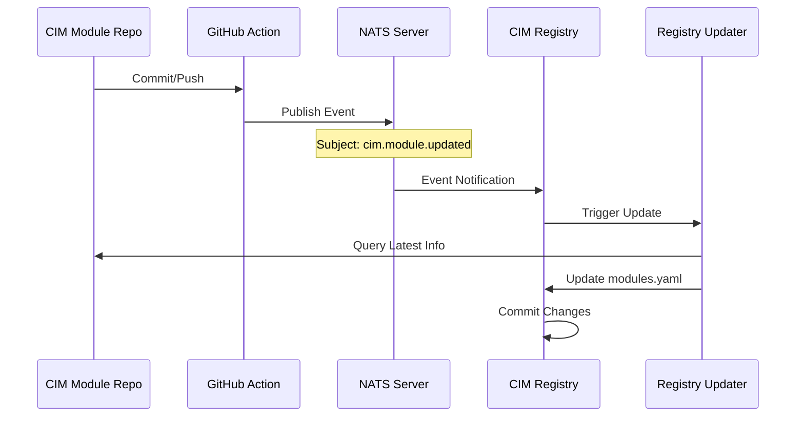

# CIM Registry Pattern

## Overview

The `thecowboyai/cim` repository serves as the **source of truth** for all CIM modules and implementations. It maintains a registry of all official modules and tracks changes across the ecosystem.

## Repository Convention

### Naming Pattern
All CIM-related repositories in the `thecowboyai` organization follow this convention:
- **Core Registry**: `cim` (this repository)
- **Modules**: `cim-*` (e.g., `cim-domain`, `cim-security`, `cim-flashstor`)
- **Domain Implementations**: `cim-domain-*` (e.g., `cim-domain-mortgage`)

### Repository Types



## Registry Structure

### Module Registry
```yaml
# /registry/modules.yaml
modules:
  cim-start:
    type: template
    description: "Starting template for new CIMs"
    repository: "https://github.com/thecowboyai/cim-start"
    version: "0.1.0"
    last_commit: "abc123def"
    last_updated: "2025-01-30T10:00:00Z"
    
  cim-domain:
    type: core
    description: "Domain patterns and base abstractions"
    repository: "https://github.com/thecowboyai/cim-domain"
    version: "0.2.0"
    last_commit: "def456ghi"
    last_updated: "2025-01-30T09:00:00Z"
    
  cim-domain-mortgage:
    type: domain
    visibility: private
    description: "Private mortgage lending implementation"
    repository: "https://github.com/thecowboyai/cim-domain-mortgage"
    version: "0.1.0"
    last_commit: "ghi789jkl"
    last_updated: "2025-01-30T11:00:00Z"
```

### Event-Driven Updates



## Implementation Components

### 1. GitHub Action for Module Repos
Each `cim-*` repository includes this workflow:

```yaml
# .github/workflows/notify-registry.yml
name: Notify CIM Registry

on:
  push:
    branches: [main]

jobs:
  notify:
    runs-on: ubuntu-latest
    steps:
      - uses: actions/checkout@v3
      
      - name: Extract Module Info
        id: module
        run: |
          echo "name=${GITHUB_REPOSITORY#*/}" >> $GITHUB_OUTPUT
          echo "commit=${GITHUB_SHA}" >> $GITHUB_OUTPUT
          echo "timestamp=$(date -Iseconds)" >> $GITHUB_OUTPUT
          
      - name: Publish Update Event
        uses: thecowboyai/nats-publish-action@v1
        with:
          server: ${{ secrets.NATS_SERVER }}
          subject: "cim.module.updated"
          payload: |
            {
              "module": "${{ steps.module.outputs.name }}",
              "repository": "${{ github.repository }}",
              "commit": "${{ steps.module.outputs.commit }}",
              "timestamp": "${{ steps.module.outputs.timestamp }}",
              "ref": "${{ github.ref }}"
            }
```

### 2. Registry Update Workflow
In the `cim` repository:

```yaml
# .github/workflows/update-registry.yml
name: Update Module Registry

on:
  workflow_dispatch:
  repository_dispatch:
    types: [module-updated]

jobs:
  update:
    runs-on: ubuntu-latest
    steps:
      - uses: actions/checkout@v3
      
      - name: Query GitHub for CIM Modules
        uses: actions/github-script@v6
        with:
          script: |
            const modules = await github.paginate(
              github.rest.search.repos,
              {
                q: 'org:thecowboyai topic:cim',
                sort: 'updated',
                per_page: 100
              }
            );
            
            // Process and update registry
            
      - name: Update Registry Files
        run: |
          # Update modules.yaml
          # Update documentation
          # Generate status reports
          
      - name: Commit Registry Updates
        uses: EndBug/add-and-commit@v9
        with:
          message: 'chore: update module registry'
          add: 'registry/'
```

### 3. Query Interface
Provide consistent ways to query the registry:

```rust
// cim-registry-client/src/lib.rs
pub struct RegistryClient {
    base_url: String,
}

impl RegistryClient {
    pub async fn list_modules(&self) -> Result<Vec<Module>> {
        // Query modules.yaml from GitHub
    }
    
    pub async fn get_module(&self, name: &str) -> Result<Module> {
        // Get specific module info
    }
    
    pub async fn list_by_type(&self, module_type: ModuleType) -> Result<Vec<Module>> {
        // Filter modules by type
    }
}
```

## Registry Files Structure

```
cim/
├── registry/
│   ├── modules.yaml              # Complete module listing
│   ├── status.json              # Current status/health
│   ├── private-domains.yaml     # Private domain registry
│   └── changelog.md             # Auto-generated changelog
├── scripts/
│   ├── update-registry.sh       # Registry update script
│   └── query-modules.sh         # Module query utilities
└── .github/
    └── workflows/
        └── update-registry.yml  # Automated updates
```

## Module Discovery

### GitHub Topics
All CIM modules must have these GitHub topics:
- `cim` - Required for all CIM-related repos
- `cim-module` - For reusable modules
- `cim-domain` - for domain implementations
- `cim-private` - For private domain implementations

### Metadata Standard
Each module repository must include:

```yaml
# cim.yaml in module root
module:
  name: "cim-domain-mortgage"
  type: "domain"
  version: "0.1.0"
  description: "Private mortgage lending CIM"
  dependencies:
    - cim-domain: "^0.2"
    - cim-security: "^0.1"
    - cim-flashstor: "^0.1"
  visibility: "private"
  category: "financial-services"
```

## Private Domain Registry

Private domains get special handling:

```yaml
# registry/private-domains.yaml
private_domains:
  financial:
    - name: cim-domain-mortgage
      owner: "acme-lending"
      deployed: true
      
  healthcare:
    - name: cim-domain-patient-care
      owner: "health-system-x"
      deployed: false
```

## Benefits

1. **Single Source of Truth**: All module information in one place
2. **Automated Updates**: Changes trigger registry updates
3. **Discoverable**: Easy to find available modules
4. **Version Tracking**: Know what versions work together
5. **Private Domain Support**: Track private implementations
6. **Event-Driven**: Real-time updates via NATS