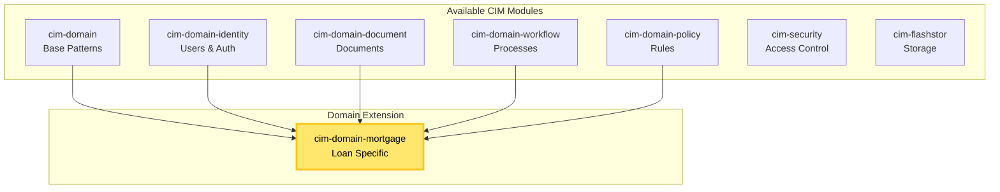

# Domain Assembly Pattern

## Core Principle: Assemble, Don't Build From Scratch

When creating a CIM for a specific business domain, we **assemble existing modules** and create minimal domain-specific extensions.

## Assembly Process

### 0. Clone cim-start Template
```bash
# Start every new CIM by cloning the template
git clone <cim-start-repo> cim-<domain-name>
cd cim-<domain-name>

# The template provides:
# - Basic CIM structure
# - NATS configuration
# - Development environment
# - Testing framework
# - CI/CD templates
```

### 1. Domain Analysis
Identify the business domain requirements:
- Core entities (e.g., loans, patients, products)
- Key workflows (e.g., underwriting, diagnosis, manufacturing)
- Compliance needs (e.g., HIPAA, SOX, industry regulations)
- Integration points (e.g., external systems, APIs)

### 2. Module Selection
Map requirements to existing modules:



### 3. Domain Extension Creation

Create a single domain module that:
- Imports and configures selected modules
- Adds domain-specific aggregates
- Defines domain events
- Implements business workflows

## Example: Private Mortgage Lending

### Module Selection
```rust
// Cargo.toml for cim-domain-mortgage
[dependencies]
cim-domain = { path = "../cim-domain" }
cim-domain-identity = { path = "../cim-domain-identity" }
cim-domain-document = { path = "../cim-domain-document" }
cim-domain-workflow = { path = "../cim-domain-workflow" }
cim-domain-policy = { path = "../cim-domain-policy" }
cim-security = { path = "../cim-security" }
cim-flashstor = { path = "../cim-flashstor" }
```

### Domain Events
```rust
// Only add domain-specific events
pub enum MortgageEvent {
    LoanApplicationSubmitted {
        application_id: ApplicationId,
        borrower_id: IdentityId, // Reuse from cim-domain-identity
        property_address: Address,
        loan_amount: Money,
    },
    UnderwritingCompleted {
        application_id: ApplicationId,
        decision: UnderwritingDecision,
        conditions: Vec<Condition>,
    },
    LoanFunded {
        loan_id: LoanId,
        funding_date: SystemTime,
        disbursement_amount: Money,
    },
}
```

### Workflow Configuration
```rust
// Configure existing workflow module for mortgage process
pub fn configure_mortgage_workflows(
    workflow_engine: &mut WorkflowEngine, // From cim-domain-workflow
) -> Result<()> {
    workflow_engine.register_workflow(
        "loan_origination",
        WorkflowDefinition {
            start: "application_received",
            nodes: vec![
                WorkflowNode::Task("credit_check"),
                WorkflowNode::Task("property_appraisal"),
                WorkflowNode::Decision("underwriting_decision"),
                WorkflowNode::Task("document_preparation"),
                WorkflowNode::Task("closing"),
            ],
            edges: mortgage_workflow_edges(),
        }
    )?;
    Ok(())
}
```

### Policy Integration
```rust
// Use existing policy module for compliance
pub fn configure_mortgage_policies(
    policy_engine: &mut PolicyEngine, // From cim-domain-policy
) -> Result<()> {
    policy_engine.add_policy(
        "lending_compliance",
        Policy {
            rules: vec![
                Rule::DebtToIncomeRatio { max: 0.43 },
                Rule::MinimumCreditScore { score: 620 },
                Rule::PropertyTypeRestrictions { 
                    allowed: vec!["single_family", "condo"] 
                },
            ],
            enforcement: Enforcement::PreAuthorization,
        }
    )?;
    Ok(())
}
```

## Assembly Guidelines

### DO:
- ✅ Reuse existing module functionality
- ✅ Create thin domain-specific layers
- ✅ Configure existing modules for domain needs
- ✅ Focus on domain events and aggregates
- ✅ Leverage existing infrastructure (NATS, storage, security)

### DON'T:
- ❌ Recreate functionality that exists in modules
- ❌ Build custom authentication (use cim-domain-identity)
- ❌ Implement custom storage (use cim-flashstor/cim-ipld)
- ❌ Create new workflow engines (configure cim-domain-workflow)
- ❌ Write security from scratch (use cim-security)

## Benefits of Assembly

1. **Faster Development**: Most functionality already exists
2. **Proven Patterns**: Modules are tested and optimized
3. **Consistent Architecture**: All domains follow same patterns
4. **Easy Maintenance**: Updates to core modules benefit all domains
5. **Interoperability**: Domains can communicate via shared event patterns

## Creating New Domain Extensions

### Step 1: Define Domain Scope
```yaml
domain: healthcare
entities:
  - Patient
  - Provider
  - Appointment
  - MedicalRecord
workflows:
  - patient_intake
  - appointment_scheduling
  - treatment_plan
  - billing
policies:
  - hipaa_compliance
  - insurance_verification
  - prescription_rules
```

### Step 2: Map to Modules
```yaml
module_mapping:
  cim-domain-identity: "Patients, Providers, Staff"
  cim-domain-document: "Medical Records, Test Results"
  cim-domain-workflow: "Treatment workflows"
  cim-domain-policy: "HIPAA, Clinical guidelines"
  cim-security: "Role-based access control"
  cim-flashstor: "Medical imaging storage"
```

### Step 3: Create Extension
```rust
// cim-domain-healthcare/src/lib.rs
pub mod patient; // Patient-specific aggregates
pub mod provider; // Provider-specific logic
pub mod clinical; // Clinical workflows
pub mod compliance; // Healthcare regulations

// Re-export configured modules
pub use cim_domain_identity as identity;
pub use cim_domain_document as records;
pub use cim_domain_workflow as clinical_workflows;
```

## Remember

The power of CIM comes from **composition**, not custom development. Each domain extension should be a thin layer that configures and extends existing modules for specific business needs.