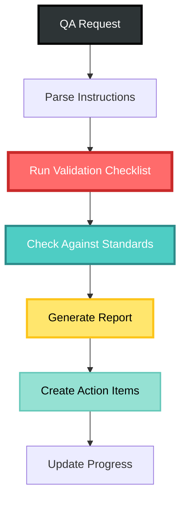

# Quality Assurance Standards

## Overview

Quality Assurance responsibilities include verifying domains maintain quality and documentation reflects proven patterns. When "QA" is invoked, comprehensive validation and reporting is performed.

## Core QA Principles

### Single Responsibility Principle
- Everything should do ONE thing and be irreducible
- Applied to all components, systems, and modules

### Test-Driven Development
- EVERYTHING is tested
- Tests written before implementation
- Comprehensive coverage required

### Domain Integration
- Inject domains through COMPOSITION, not dependency
- Maintain loose coupling between domains
- Use event-driven communication

### Zero CRUD Violations
- All completed domains MUST follow event-driven architecture
- Use remove/add sequences instead of update operations
- Maintain event sourcing principles

## QA Validation Checklist

### Code Quality
- ✅ All code builds and runs as documented
- ✅ All tests are passing
- ✅ Sufficient test coverage for core functionality
- ✅ No orphaned or unused code

### Documentation Quality
- ✅ Sufficient documentation for developers and users
- ✅ Documentation is explicit and follows .cursor/rules
- ✅ API documentation is complete
- ✅ Usage examples are provided

### Architecture Compliance
- ✅ Follows Domain-Driven Design principles
- ✅ Proper modularization by DDD components
- ✅ Single Responsibility Principle applied
- ✅ Event-driven patterns implemented correctly

## Domain Completion Validation

For each domain claiming "complete" status, verify:

1. **Event-Driven Architecture**
   - Zero CRUD violations
   - All operations through events
   - Proper event naming and structure

2. **Comprehensive Tests**
   - All handlers tested
   - All aggregates tested
   - All queries tested
   - Integration tests present

3. **CQRS Implementation**
   - Clear command/query separation
   - Projections properly implemented
   - Read models optimized

4. **Cross-Domain Integration**
   - Proven integration patterns used
   - Event-based communication only
   - No direct dependencies

5. **Documentation**
   - Complete API documentation
   - Usage examples provided
   - Integration guides available

## Current Domain Status

### Validated Complete Domains
- ✅ **Graph Domain**: 41/41 tests, full CQRS, 9/18 queries
- ✅ **Identity Domain**: 54/54 tests, person/organization management
- ✅ **Person Domain**: 2/2 tests, event-driven contacts
- ✅ **Agent Domain**: 7/7 tests, AI agent foundation
- ✅ **Git Domain**: Working cross-domain integration

## Documentation Management

### Design Documentation (/doc/design)
- Verify compliance with .cursor/rules
- Move deprecated work to /doc/archive
- Ensure documentation is current
- Validate against implementation

### Planning Documentation (/doc/plan)
- Verify compliance with .cursor/rules
- Archive completed plans
- Ensure plans reflect current work
- Update based on progress

### Progress Tracking (/doc/progress)
- Maximum 10 files in directory
- Archive completed work within 1 week
- Use /doc/progress/backlog/ for future items
- Keep progress.json as single source of truth
- Maintain only recent milestones (last 2-3)

### Source Code (/src)
- Verify .cursor/rules compliance
- Check DDD modularization
- Validate Single Responsibility Principle
- Ensure proper component/system separation

## Reporting Requirements

### Report Structure
1. **Location**: /doc/qa/[descriptive-title].md (no date in filename)
2. **Content**:
   - Executive summary
   - Validation results by category
   - Issues found with severity
   - Recommendations for improvement

### Action Items
- **Code Fixes**: Create plan in /doc/plan/
- **Work in Progress**: Document in /doc/progress/
- **Progress Tracking**: Update progress.json

## Validation Against Proven Patterns

Check all work against `.cursor/rules/proven-patterns.mdc`:

### Architecture Patterns
- Zero CRUD violations maintained
- Cross-domain integration follows patterns
- Event sourcing properly implemented
- CQRS patterns correctly applied

### Testing Standards
- 100% coverage for completed domains
- Integration tests for cross-domain communication
- Event handler tests comprehensive
- Command handler tests complete

### Documentation Standards
- API documentation complete
- Usage examples provided
- Integration guides available
- Progress tracking current

## QA Process Flow

## Quality Metrics

### Code Quality Metrics
- Test coverage percentage
- Build success rate
- Test pass rate
- Documentation coverage

### Architecture Metrics
- Domain boundary violations
- CRUD operation count
- Event consistency
- Cross-domain coupling

### Process Metrics
- Time to complete QA
- Issues found per domain
- Resolution time
- Documentation currency