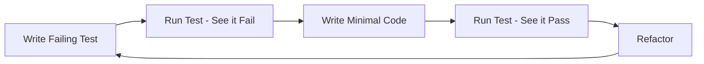

# TDD (Test-Driven Development) Workflow for CIM

## Overview

This document defines the mandatory TDD workflow for all CIM development. Every feature, bug fix, or refactoring MUST follow this process.

## The TDD Cycle



## Step-by-Step Process

### 1. RED Phase - Write a Failing Test

Before writing ANY production code:

```rust
#[cfg(test)]
mod tests {
    use super::*;

    #[test]
    fn test_network_create_with_valid_cidr() {
        // Arrange
        let cidr = "10.0.0.0/24";
        
        // Act
        let result = Network::create(cidr);
        
        // Assert
        assert!(result.is_ok());
        let network = result.unwrap();
        assert_eq!(network.cidr().to_string(), cidr);
    }
}
```

### 2. GREEN Phase - Make it Pass

Write the MINIMAL code to pass the test:

```rust
pub struct Network {
    cidr: Cidr,
}

impl Network {
    pub fn create(cidr: &str) -> Result<Self, NetworkError> {
        let cidr = Cidr::from_str(cidr)
            .map_err(|_| NetworkError::InvalidCidr)?;
        
        Ok(Self { cidr })
    }
    
    pub fn cidr(&self) -> &Cidr {
        &self.cidr
    }
}
```

### 3. REFACTOR Phase - Improve the Code

Once green, refactor while keeping tests passing:

```rust
// Add validation, better error handling, etc.
impl Network {
    pub fn create(cidr: &str) -> Result<Self, NetworkError> {
        let cidr = Cidr::from_str(cidr)
            .map_err(|e| NetworkError::InvalidCidr(e.to_string()))?;
        
        // Add business rules
        if !Self::is_private_network(&cidr) {
            return Err(NetworkError::PublicNetworkNotAllowed);
        }
        
        Ok(Self { cidr })
    }
}
```

## Test Categories

### 1. Unit Tests
Test individual components in isolation:

```rust
#[cfg(test)]
mod unit_tests {
    use super::*;

    #[test]
    fn subnet_allocation_respects_boundaries() {
        let network = Network::create("10.0.0.0/24").unwrap();
        let subnet = network.allocate_subnet(26).unwrap();
        
        assert!(network.contains(&subnet));
        assert_eq!(subnet.prefix_len(), 26);
    }
}
```

### 2. Integration Tests
Test component interactions:

```rust
#[cfg(test)]
mod integration_tests {
    use super::*;

    #[tokio::test]
    async fn network_service_creates_and_stores_network() {
        // Given
        let event_store = InMemoryEventStore::new();
        let service = NetworkService::new(event_store);
        
        // When
        let command = CreateNetwork {
            id: NetworkId::new(),
            cidr: "10.0.0.0/16".to_string(),
        };
        let result = service.handle(command).await;
        
        // Then
        assert!(result.is_ok());
        let events = service.get_events(&command.id).await.unwrap();
        assert_eq!(events.len(), 1);
    }
}
```

### 3. Property-Based Tests
Test invariants with generated data:

```rust
#[cfg(test)]
mod property_tests {
    use proptest::prelude::*;

    proptest! {
        #[test]
        fn subnet_always_within_parent_network(
            network_bits in 8u8..24,
            subnet_bits in 24u8..32,
        ) {
            prop_assume!(subnet_bits > network_bits);
            
            let network_cidr = format!("10.0.0.0/{}", network_bits);
            let network = Network::create(&network_cidr).unwrap();
            
            if let Ok(subnet) = network.allocate_subnet(subnet_bits) {
                prop_assert!(network.contains(&subnet));
            }
        }
    }
}
```

### 4. BDD Specifications
Define behavior in business terms:

```gherkin
Feature: Network Management
  As a network administrator
  I want to create and manage networks
  So that I can allocate resources efficiently

  Scenario: Create a private network
    Given I have admin permissions
    When I create a network with CIDR "10.0.0.0/16"
    Then the network should be created successfully
    And the network should have 65536 available addresses
    
  Scenario: Prevent public network creation
    Given I have admin permissions
    When I try to create a network with CIDR "8.8.8.0/24"
    Then the creation should fail
    And I should see an error "Public networks are not allowed"
```

## TDD Best Practices

### 1. One Test at a Time
- Write ONE failing test
- Make it pass
- Refactor
- Repeat

### 2. Test Naming Convention
```rust
#[test]
fn <unit>_<scenario>_<expected_behavior>() {
    // Example: network_create_with_invalid_cidr_returns_error
}
```

### 3. AAA Pattern (Arrange, Act, Assert)
```rust
#[test]
fn subnet_allocation_reduces_available_space() {
    // Arrange
    let network = Network::create("10.0.0.0/24").unwrap();
    let initial_available = network.available_addresses();
    
    // Act
    let _subnet = network.allocate_subnet(26).unwrap();
    
    // Assert
    let final_available = network.available_addresses();
    assert_eq!(final_available, initial_available - 64);
}
```

### 4. Test Data Builders
```rust
#[cfg(test)]
mod builders {
    use super::*;

    pub struct NetworkBuilder {
        cidr: String,
        name: Option<String>,
    }

    impl NetworkBuilder {
        pub fn new() -> Self {
            Self {
                cidr: "10.0.0.0/24".to_string(),
                name: None,
            }
        }

        pub fn with_cidr(mut self, cidr: &str) -> Self {
            self.cidr = cidr.to_string();
            self
        }

        pub fn with_name(mut self, name: &str) -> Self {
            self.name = Some(name.to_string());
            self
        }

        pub fn build(self) -> Network {
            let mut network = Network::create(&self.cidr).unwrap();
            if let Some(name) = self.name {
                network.set_name(name);
            }
            network
        }
    }
}
```

## TDD Checklist

Before committing any code:

- [ ] All new functionality has tests written FIRST
- [ ] Tests follow AAA pattern
- [ ] Test names clearly describe the scenario
- [ ] Both positive and negative cases are tested
- [ ] Edge cases are covered
- [ ] Tests are independent and can run in any order
- [ ] No test depends on external state
- [ ] Mock/stub external dependencies
- [ ] Tests run quickly (< 1 second per test)
- [ ] Coverage includes happy path, edge cases, and error cases

## Common Anti-Patterns to Avoid

### ❌ Writing Tests After Code
```rust
// BAD: Implementation exists before test
impl Network {
    pub fn complex_business_logic(&self) -> Result<Output, Error> {
        // 100 lines of code written without tests
    }
}

// Test written after the fact
#[test]
fn test_complex_logic() {
    // Retrofitted test that probably misses cases
}
```

### ❌ Testing Implementation Details
```rust
// BAD: Testing private internals
#[test]
fn test_internal_cache_size() {
    let network = Network::new();
    assert_eq!(network.cache.len(), 0); // Don't test internals!
}

// GOOD: Test behavior, not implementation
#[test]
fn repeated_queries_return_consistent_results() {
    let network = Network::new();
    let first = network.query("subnet-1");
    let second = network.query("subnet-1");
    assert_eq!(first, second);
}
```

### ❌ Overly Coupled Tests
```rust
// BAD: Tests depend on each other
static mut NETWORK: Option<Network> = None;

#[test]
fn test_1_create_network() {
    unsafe {
        NETWORK = Some(Network::create("10.0.0.0/16").unwrap());
    }
}

#[test]
fn test_2_use_network() {
    unsafe {
        let network = NETWORK.as_ref().unwrap(); // Depends on test_1!
    }
}
```

## Tooling

### Required Tools
```toml
[dev-dependencies]
# Unit testing
rstest = "0.18"
mockall = "0.11"

# Property testing
proptest = "1.4"
quickcheck = "1.0"

# BDD testing
cucumber = "0.20"

# Test coverage
tarpaulin = "0.27"
```

### Running Tests
```bash
# Run all tests
cargo test

# Run with coverage
cargo tarpaulin --out Html

# Run specific test
cargo test test_network_creation

# Run property tests with more iterations
PROPTEST_CASES=10000 cargo test

# Run BDD tests
cargo test --features cucumber
```

## Continuous Integration

All PRs must:
1. Have 100% test coverage for new code
2. Pass all existing tests
3. Include tests written BEFORE implementation
4. Show test commit before implementation commit

## Summary

TDD is not optional in CIM development. Every line of production code must be justified by a failing test. This discipline ensures:

- High quality, bug-free code
- Living documentation through tests
- Confidence in refactoring
- Clear understanding of requirements
- Reduced debugging time

Remember: **Red → Green → Refactor** - always in that order!