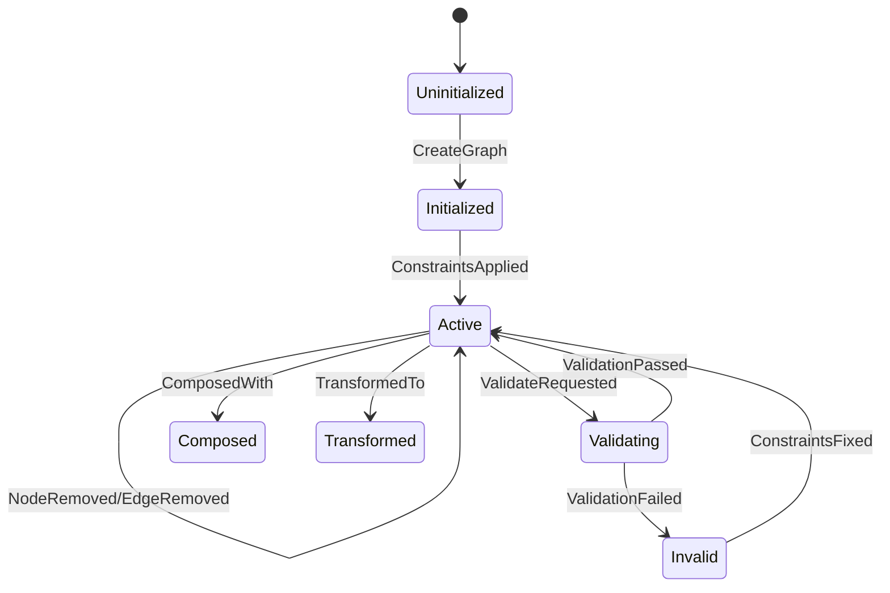
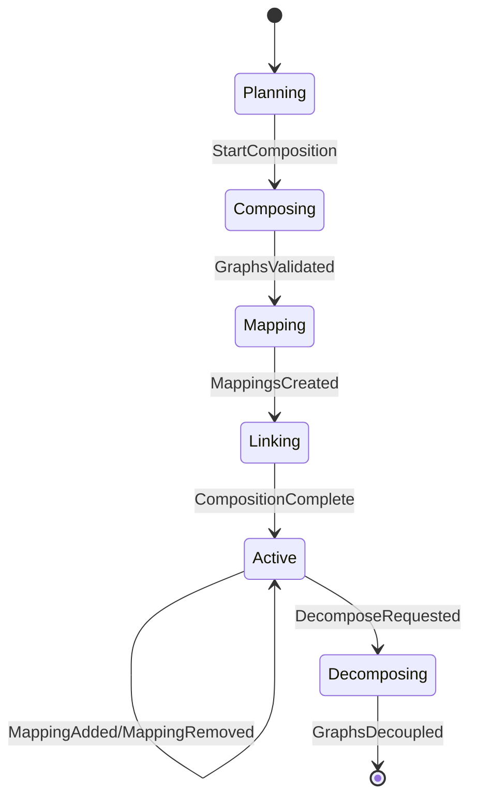
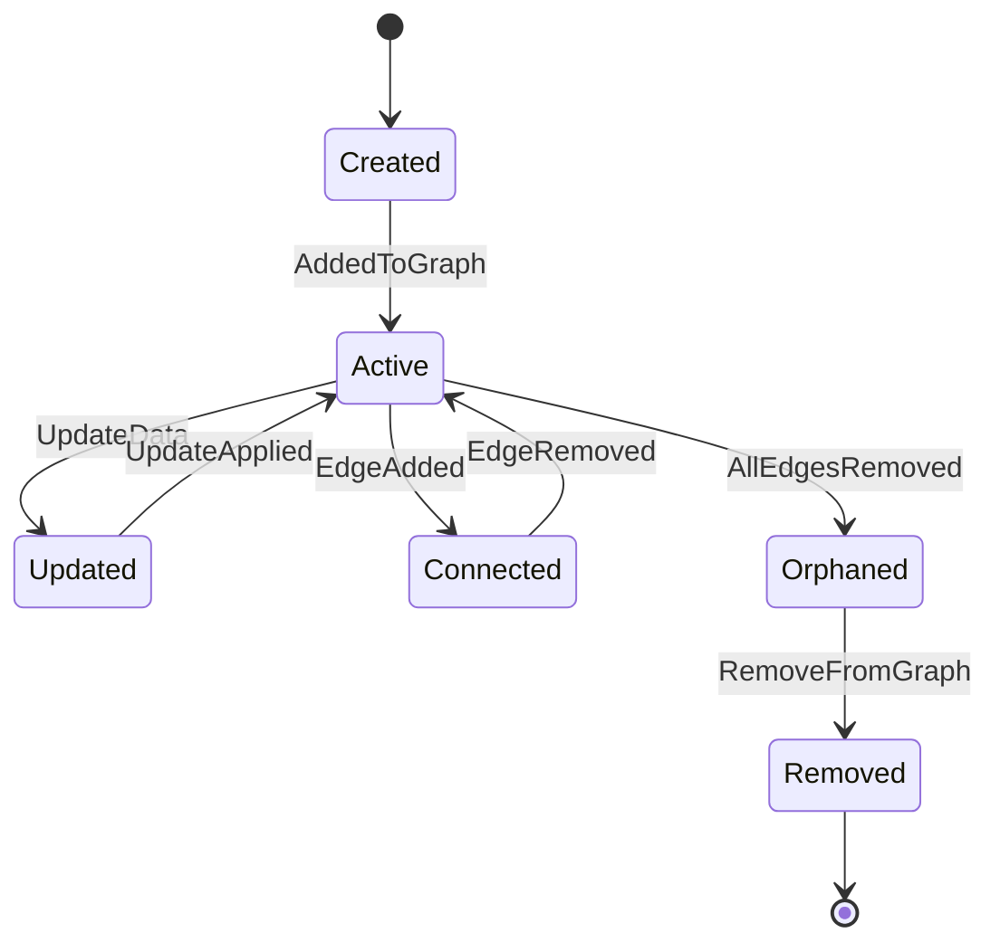
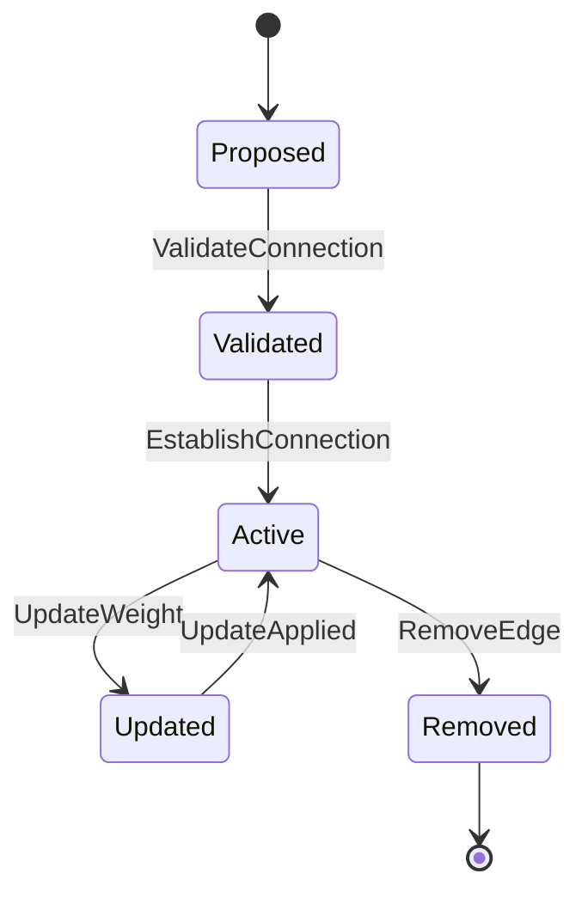
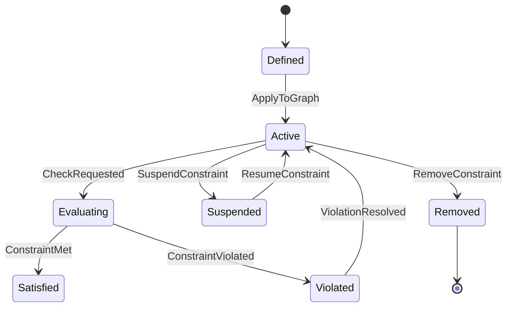
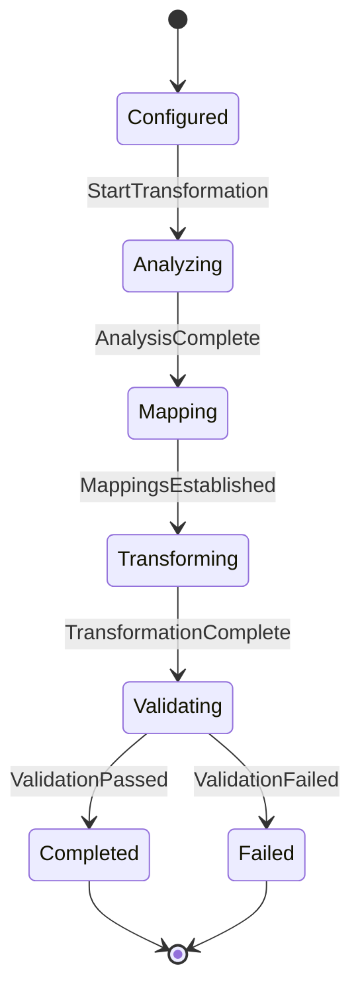
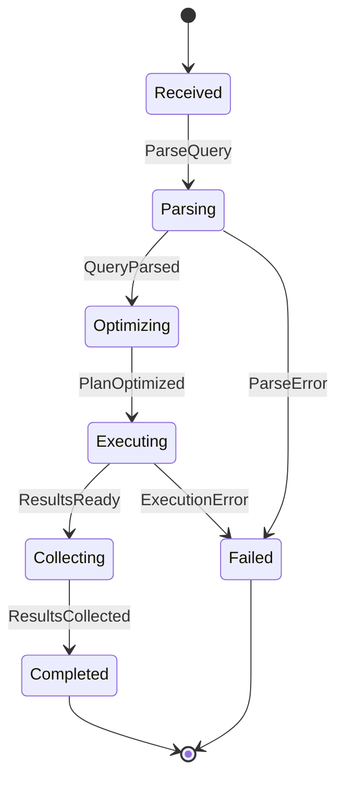

# CIM Graph Aggregate State Transitions

## Overview

This document defines the state transitions and events produced by each aggregate in the CIM Graph domain. Each aggregate maintains consistency through well-defined state machines and emits events for all state changes.

## Graph Aggregate

### State Machine



### State Transitions and Events

```graph
GraphAggregateTransitions {
    aggregate: "Graph",
    states: ["Uninitialized", "Initialized", "Active", "Validating", "Invalid", "Composed", "Transformed"],
    transitions: [
        {
            from: "Uninitialized",
            to: "Initialized",
            command: "CreateGraph",
            guards: ["valid_graph_type", "valid_constraints"],
            events: [
                {
                    type: "GraphCreated",
                    data: {
                        graph_id: GraphId,
                        graph_type: GraphType,
                        timestamp: Timestamp
                    }
                },
                {
                    type: "MetadataInitialized",
                    data: {
                        graph_id: GraphId,
                        metadata: Metadata
                    }
                }
            ]
        },
        {
            from: "Initialized",
            to: "Active",
            command: "ApplyConstraints",
            guards: ["constraints_valid", "no_conflicts"],
            events: [
                {
                    type: "ConstraintsApplied",
                    data: {
                        graph_id: GraphId,
                        constraints: Vec<Constraint>
                    }
                },
                {
                    type: "GraphActivated",
                    data: {
                        graph_id: GraphId,
                        ready_at: Timestamp
                    }
                }
            ]
        },
        {
            from: "Active",
            to: "Active",
            command: "AddNode",
            guards: ["node_unique", "type_valid", "constraints_satisfied"],
            events: [
                {
                    type: "NodeAdded",
                    data: {
                        graph_id: GraphId,
                        node_id: NodeId,
                        node_data: NodeData
                    }
                },
                {
                    type: "GraphStructureUpdated",
                    data: {
                        graph_id: GraphId,
                        node_count: usize,
                        version: Version
                    }
                },
                {
                    type: "IndexesUpdated",
                    data: {
                        graph_id: GraphId,
                        affected_indexes: Vec<IndexType>
                    }
                }
            ]
        },
        {
            from: "Active",
            to: "Active",
            command: "ConnectNodes",
            guards: ["nodes_exist", "edge_valid", "no_constraint_violation"],
            events: [
                {
                    type: "EdgeAdded",
                    data: {
                        graph_id: GraphId,
                        edge_id: EdgeId,
                        source: NodeId,
                        target: NodeId,
                        edge_data: EdgeData
                    }
                },
                {
                    type: "NodesConnected",
                    data: {
                        graph_id: GraphId,
                        source: NodeId,
                        target: NodeId
                    }
                },
                {
                    type: "PathsUpdated",
                    data: {
                        graph_id: GraphId,
                        new_paths: Vec<GraphPath>
                    }
                }
            ]
        },
        {
            from: "Active",
            to: "Validating",
            command: "ValidateGraph",
            guards: [],
            events: [
                {
                    type: "ValidationStarted",
                    data: {
                        graph_id: GraphId,
                        validation_id: ValidationId,
                        rules: Vec<ValidationRule>
                    }
                }
            ]
        },
        {
            from: "Validating",
            to: "Invalid",
            command: "ValidationComplete",
            guards: ["has_violations"],
            events: [
                {
                    type: "ValidationFailed",
                    data: {
                        graph_id: GraphId,
                        violations: Vec<ConstraintViolation>
                    }
                },
                {
                    type: "GraphMarkedInvalid",
                    data: {
                        graph_id: GraphId,
                        reason: String
                    }
                }
            ]
        }
    ]
}
```

## ComposedGraph Aggregate

### State Machine



### State Transitions and Events

```graph
ComposedGraphTransitions {
    aggregate: "ComposedGraph",
    states: ["Planning", "Composing", "Mapping", "Linking", "Active", "Decomposing"],
    transitions: [
        {
            from: "Planning",
            to: "Composing",
            command: "StartComposition",
            guards: ["graphs_exist", "compatible_types"],
            events: [
                {
                    type: "CompositionStarted",
                    data: {
                        composition_id: GraphId,
                        source_graphs: Vec<GraphId>
                    }
                }
            ]
        },
        {
            from: "Composing",
            to: "Mapping",
            command: "ValidateGraphs",
            guards: ["all_graphs_valid", "no_conflicts"],
            events: [
                {
                    type: "GraphsValidated",
                    data: {
                        composition_id: GraphId,
                        validation_results: Vec<ValidationResult>
                    }
                },
                {
                    type: "ReadyForMapping",
                    data: {
                        composition_id: GraphId
                    }
                }
            ]
        },
        {
            from: "Mapping",
            to: "Linking",
            command: "CreateMappings",
            guards: ["mappings_valid", "nodes_exist"],
            events: [
                {
                    type: "MappingsCreated",
                    data: {
                        composition_id: GraphId,
                        mappings: Vec<GraphMapping>
                    }
                },
                {
                    type: "CrossGraphEdgesEstablished",
                    data: {
                        composition_id: GraphId,
                        edge_count: usize
                    }
                }
            ]
        },
        {
            from: "Linking",
            to: "Active",
            command: "FinalizeComposition",
            guards: ["all_mappings_valid"],
            events: [
                {
                    type: "CompositionCompleted",
                    data: {
                        graph_id: GraphId,
                        subgraph_count: usize,
                        total_mappings: usize
                    }
                },
                {
                    type: "ComposedGraphActivated",
                    data: {
                        graph_id: GraphId
                    }
                }
            ]
        }
    ]
}
```

## Node Aggregate

### State Machine



### State Transitions and Events

```graph
NodeAggregateTransitions {
    aggregate: "Node",
    states: ["Created", "Active", "Updated", "Connected", "Orphaned", "Removed"],
    transitions: [
        {
            from: "Created",
            to: "Active",
            command: "AddToGraph",
            guards: ["graph_exists", "id_unique"],
            events: [
                {
                    type: "NodeAddedToGraph",
                    data: {
                        node_id: NodeId,
                        graph_id: GraphId,
                        node_data: NodeData
                    }
                }
            ]
        },
        {
            from: "Active",
            to: "Updated",
            command: "UpdateNodeData",
            guards: ["node_exists", "data_valid"],
            events: [
                {
                    type: "NodeDataUpdateRequested",
                    data: {
                        node_id: NodeId,
                        old_data: NodeData,
                        new_data: NodeData
                    }
                }
            ]
        },
        {
            from: "Active",
            to: "Connected",
            command: "ConnectToNode",
            guards: ["target_exists", "edge_valid"],
            events: [
                {
                    type: "NodeConnected",
                    data: {
                        source: NodeId,
                        target: NodeId,
                        edge_id: EdgeId
                    }
                },
                {
                    type: "NodeDegreeChanged",
                    data: {
                        node_id: NodeId,
                        old_degree: usize,
                        new_degree: usize
                    }
                }
            ]
        }
    ]
}
```

## Edge Aggregate

### State Machine



### State Transitions and Events

```graph
EdgeAggregateTransitions {
    aggregate: "Edge",
    states: ["Proposed", "Validated", "Active", "Updated", "Removed"],
    transitions: [
        {
            from: "Proposed",
            to: "Validated",
            command: "ValidateEdge",
            guards: ["source_exists", "target_exists", "edge_allowed"],
            events: [
                {
                    type: "EdgeValidated",
                    data: {
                        edge_id: EdgeId,
                        source: NodeId,
                        target: NodeId
                    }
                }
            ]
        },
        {
            from: "Validated",
            to: "Active",
            command: "EstablishEdge",
            guards: ["no_duplicate", "constraints_satisfied"],
            events: [
                {
                    type: "EdgeEstablished",
                    data: {
                        edge_id: EdgeId,
                        source: NodeId,
                        target: NodeId,
                        edge_data: EdgeData
                    }
                },
                {
                    type: "GraphConnectivityChanged",
                    data: {
                        graph_id: GraphId,
                        components_before: usize,
                        components_after: usize
                    }
                }
            ]
        }
    ]
}
```

## Constraint Aggregate

### State Machine



### State Transitions and Events

```graph
ConstraintAggregateTransitions {
    aggregate: "Constraint",
    states: ["Defined", "Active", "Evaluating", "Satisfied", "Violated", "Suspended", "Removed"],
    transitions: [
        {
            from: "Defined",
            to: "Active",
            command: "ApplyConstraint",
            guards: ["graph_exists", "constraint_valid"],
            events: [
                {
                    type: "ConstraintApplied",
                    data: {
                        constraint_id: ConstraintId,
                        graph_id: GraphId,
                        constraint_type: ConstraintType
                    }
                }
            ]
        },
        {
            from: "Active",
            to: "Evaluating",
            command: "EvaluateConstraint",
            guards: [],
            events: [
                {
                    type: "ConstraintEvaluationStarted",
                    data: {
                        constraint_id: ConstraintId,
                        graph_state: GraphSnapshot
                    }
                }
            ]
        },
        {
            from: "Evaluating",
            to: "Violated",
            command: "ReportViolation",
            guards: ["violation_detected"],
            events: [
                {
                    type: "ConstraintViolated",
                    data: {
                        constraint_id: ConstraintId,
                        violation: ConstraintViolation,
                        severity: Severity
                    }
                },
                {
                    type: "GraphOperationRejected",
                    data: {
                        graph_id: GraphId,
                        operation: Operation,
                        reason: String
                    }
                }
            ]
        }
    ]
}
```

## Transformation Aggregate

### State Machine



### State Transitions and Events

```graph
TransformationAggregateTransitions {
    aggregate: "Transformation",
    states: ["Configured", "Analyzing", "Mapping", "Transforming", "Validating", "Completed", "Failed"],
    transitions: [
        {
            from: "Configured",
            to: "Analyzing",
            command: "StartTransformation",
            guards: ["source_graph_exists", "target_type_valid"],
            events: [
                {
                    type: "TransformationStarted",
                    data: {
                        transformation_id: TransformationId,
                        source_graph: GraphId,
                        target_type: GraphType
                    }
                }
            ]
        },
        {
            from: "Analyzing",
            to: "Mapping",
            command: "CompleteAnalysis",
            guards: ["transformation_feasible"],
            events: [
                {
                    type: "TransformationAnalysisCompleted",
                    data: {
                        transformation_id: TransformationId,
                        feasibility: FeasibilityReport,
                        node_mappings: Vec<NodeTypeMapping>,
                        edge_mappings: Vec<EdgeTypeMapping>
                    }
                }
            ]
        },
        {
            from: "Transforming",
            to: "Validating",
            command: "CompleteTransformation",
            guards: ["all_nodes_transformed", "all_edges_transformed"],
            events: [
                {
                    type: "TransformationCompleted",
                    data: {
                        transformation_id: TransformationId,
                        nodes_transformed: usize,
                        edges_transformed: usize
                    }
                },
                {
                    type: "TargetGraphCreated",
                    data: {
                        source_graph: GraphId,
                        target_graph: GraphId,
                        provenance: TransformationProvenance
                    }
                }
            ]
        }
    ]
}
```

## Query Aggregate

### State Machine



### State Transitions and Events

```graph
QueryAggregateTransitions {
    aggregate: "Query",
    states: ["Received", "Parsing", "Optimizing", "Executing", "Collecting", "Completed", "Failed"],
    transitions: [
        {
            from: "Received",
            to: "Parsing",
            command: "ParseQuery",
            guards: ["query_not_empty"],
            events: [
                {
                    type: "QueryReceived",
                    data: {
                        query_id: QueryId,
                        query_text: String,
                        graph_id: GraphId
                    }
                }
            ]
        },
        {
            from: "Parsing",
            to: "Optimizing",
            command: "CompleteParsin",
            guards: ["syntax_valid"],
            events: [
                {
                    type: "QueryParsed",
                    data: {
                        query_id: QueryId,
                        ast: QueryAST,
                        referenced_nodes: Vec<NodeId>
                    }
                }
            ]
        },
        {
            from: "Executing",
            to: "Collecting",
            command: "ExecuteQuery",
            guards: ["resources_available"],
            events: [
                {
                    type: "QueryExecuted",
                    data: {
                        query_id: QueryId,
                        rows_examined: usize,
                        execution_time: Duration
                    }
                },
                {
                    type: "ResultSetProduced",
                    data: {
                        query_id: QueryId,
                        result_count: usize
                    }
                }
            ]
        }
    ]
}
```

## Acceptance Tests for Aggregate Transactions

### Test Structure

```rust
#[test]
fn test_aggregate_transaction_produces_expected_events() {
    // Given: Initial aggregate state
    let mut aggregate = Aggregate::new();
    let mut event_store = EventStore::new();
    
    // When: Command is executed
    let events = aggregate.handle_command(command)?;
    
    // Then: Expected events are produced
    assert_events_match(&events, &expected_events);
    
    // And: State transition is correct
    assert_eq!(aggregate.state(), expected_state);
    
    // And: Events can reconstruct state
    let replayed = Aggregate::from_events(&events);
    assert_eq!(replayed, aggregate);
}
```

### Graph Aggregate Transaction Tests

```rust
#[test]
fn test_graph_creation_transaction() {
    // Test: CreateGraph -> GraphCreated + MetadataInitialized
    let command = CreateGraphCommand {
        graph_type: GraphType::IpldGraph,
        metadata: default_metadata(),
    };
    
    let expected_events = vec![
        GraphCreated {
            graph_id: generated_id(),
            graph_type: GraphType::IpldGraph,
            timestamp: now(),
        },
        MetadataInitialized {
            graph_id: generated_id(),
            metadata: default_metadata(),
        },
    ];
    
    test_aggregate_transaction(command, expected_events);
}

#[test]
fn test_node_addition_transaction() {
    // Test: AddNode -> NodeAdded + GraphStructureUpdated + IndexesUpdated
    let mut graph = create_active_graph();
    let command = AddNodeCommand {
        node_data: test_node_data(),
    };
    
    let expected_events = vec![
        NodeAdded {
            graph_id: graph.id(),
            node_id: generated_id(),
            node_data: test_node_data(),
        },
        GraphStructureUpdated {
            graph_id: graph.id(),
            node_count: 1,
            version: Version::new(2),
        },
        IndexesUpdated {
            graph_id: graph.id(),
            affected_indexes: vec![IndexType::NodeIndex],
        },
    ];
    
    test_aggregate_transaction_on(graph, command, expected_events);
}
```

### Composed Graph Transaction Tests

```rust
#[test]
fn test_composition_transaction() {
    // Test: Full composition flow
    let graphs = vec![create_ipld_graph(), create_context_graph()];
    let command = ComposeGraphsCommand {
        graphs: graphs.clone(),
        mappings: test_mappings(),
    };
    
    let expected_events = vec![
        CompositionStarted {
            composition_id: generated_id(),
            source_graphs: graph_ids(&graphs),
        },
        GraphsValidated {
            composition_id: generated_id(),
            validation_results: all_valid(&graphs),
        },
        MappingsCreated {
            composition_id: generated_id(),
            mappings: test_mappings(),
        },
        CompositionCompleted {
            graph_id: generated_id(),
            subgraph_count: 2,
            total_mappings: test_mappings().len(),
        },
    ];
    
    test_aggregate_transaction(command, expected_events);
}
```

### Transaction Invariant Tests

```rust
#[test]
fn test_aggregate_invariants_maintained() {
    // Test that all transactions maintain aggregate invariants
    property_test!(|commands: Vec<Command>| {
        let mut aggregate = Aggregate::new();
        let mut all_events = vec![];
        
        for command in commands {
            if let Ok(events) = aggregate.handle_command(command) {
                all_events.extend(events);
                
                // Invariant: State is always valid
                assert!(aggregate.is_valid_state());
                
                // Invariant: Events can reconstruct state
                let replayed = Aggregate::from_events(&all_events);
                assert_eq!(replayed.state(), aggregate.state());
            }
        }
    });
}
```

### Event Ordering Tests

```rust
#[test]
fn test_event_causality_preserved() {
    // Test that events maintain causal ordering
    let mut graph = Graph::new();
    
    // Execute multiple commands
    let events1 = graph.handle(AddNodeCommand { id: "A" })?;
    let events2 = graph.handle(AddNodeCommand { id: "B" })?;
    let events3 = graph.handle(ConnectNodesCommand { from: "A", to: "B" })?;
    
    // Verify causality chain
    assert!(events1[0].timestamp < events2[0].timestamp);
    assert!(events2[0].timestamp < events3[0].timestamp);
    assert_eq!(events3[0].causation_id, Some(events2[0].event_id));
}
```

## Event Store Integration

### Event Persistence

```rust
impl EventStore for GraphEventStore {
    fn append(&mut self, events: Vec<Event>) -> Result<()> {
        for event in events {
            // Persist with metadata
            self.store.insert(EventRecord {
                event_id: event.id,
                aggregate_id: event.aggregate_id,
                event_type: event.event_type(),
                payload: serialize(&event),
                timestamp: event.timestamp,
                version: event.version,
                causation_id: event.causation_id,
                correlation_id: event.correlation_id,
            })?;
        }
        Ok(())
    }
    
    fn load_aggregate(&self, id: AggregateId) -> Result<Vec<Event>> {
        self.store
            .query()
            .filter_by_aggregate(id)
            .order_by_version()
            .execute()
    }
}
```

## Next Steps

1. Implement state machines for each aggregate
2. Create event definitions with proper typing
3. Build transaction handlers with validation
4. Set up event store infrastructure
5. Create comprehensive acceptance test suite