# Graph Domain Architecture Diagrams

## System Architecture Overview

## Event Flow Architecture

## Graph Type Hierarchy

## Component Interaction Diagram

## Data Flow Through Graph Types

## Graph Lifecycle State Machine

## Semantic Composition Patterns

## Query Execution Flow

## Event Sourcing Architecture

## Deployment Architecture

```mermaid
graph TB
    subgraph "Client Layer"
        CLI[CLI Tool]
        WebUI[Web UI]
        API_Client[API Client]
    end
    
    subgraph "Gateway Layer"
        Gateway[API Gateway]
        Auth[Auth Service]
        RateLimit[Rate Limiter]
    end
    
    subgraph "Service Layer"
        GraphAPI[Graph API Service]
        EventService[Event Service]
        QueryService[Query Service]
        ComposeService[Composition Service]
    end
    
    subgraph "Domain Layer"
        GraphDomain[Graph Domain Core]
        Registry[Graph Registry]
        EventHandlers[Event Handlers]
    end
    
    subgraph "Infrastructure Layer"
        NATS[NATS Cluster]
        EventStore[(Event Store)]
        ProjectionDB[(Projections)]
        Cache[Redis Cache]
    end
    
    CLI --> Gateway
    WebUI --> Gateway
    API_Client --> Gateway
    
    Gateway --> Auth
    Gateway --> RateLimit
    Gateway --> GraphAPI
    
    GraphAPI --> GraphDomain
    EventService --> GraphDomain
    QueryService --> GraphDomain
    ComposeService --> GraphDomain
    
    GraphDomain --> Registry
    GraphDomain --> EventHandlers
    
    EventHandlers --> NATS
    NATS --> EventStore
    EventStore --> ProjectionDB
    QueryService --> Cache
    Cache --> ProjectionDB
```

These architecture diagrams illustrate:
1. **System Architecture**: High-level component organization
2. **Event Flow**: How events propagate through the system
3. **Type Hierarchy**: Trait relationships and inheritance
4. **Component Interactions**: How subsystems communicate
5. **Data Flow**: Movement through graph types
6. **Lifecycle Management**: State transitions for graphs
7. **Composition Patterns**: Ways graphs can be combined
8. **Query Execution**: How queries are processed
9. **Event Sourcing**: CQRS implementation
10. **Deployment View**: Production architecture