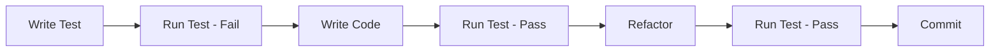
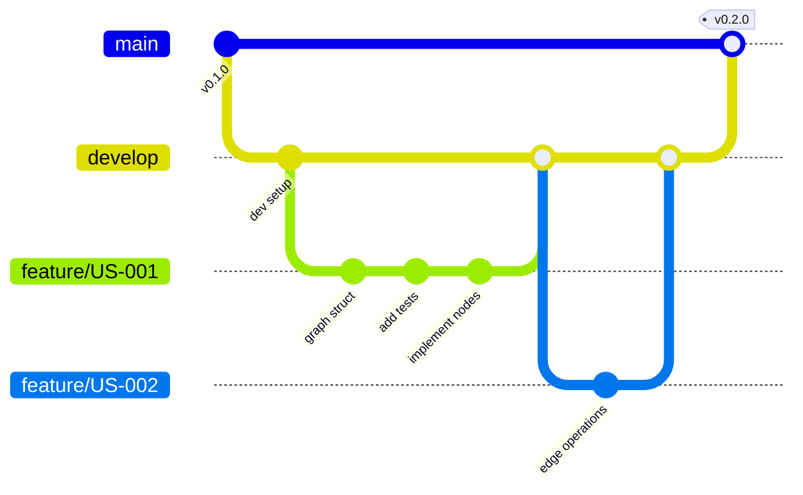

# CIM Graph Development Workflow

## Overview

This document defines the development workflow for the CIM Graph project, ensuring consistent practices, quality standards, and efficient collaboration.

## Development Process

### 1. Story Selection

```graph
StoryWorkflow {
    process: [
        "Review user stories in backlog",
        "Select story based on priority and dependencies", 
        "Create feature branch from main",
        "Break down into implementation tasks"
    ],
    branch_naming: "feature/<story-id>-<brief-description>",
    example: "feature/US-001-create-basic-graph"
}
```

### 2. Test-Driven Development (TDD)



**TDD Cycle for Graph Operations**:

```rust
// 1. Write the test first
#[test]
fn test_add_node_to_empty_graph() {
    // Given
    let mut graph = Graph::new();
    
    // When
    let node_id = graph.add_node("test_node").unwrap();
    
    // Then
    assert!(graph.contains_node(&node_id));
    assert_eq!(graph.node_count(), 1);
}

// 2. Implement minimal code to pass
impl Graph {
    pub fn add_node(&mut self, data: impl Into<NodeData>) -> Result<NodeId> {
        // Implementation
    }
}

// 3. Refactor and improve
```

### 3. Development Checklist

For each feature implementation:

- [ ] Create feature branch from main
- [ ] Write acceptance tests from user story
- [ ] Implement using TDD approach
- [ ] Ensure all tests pass
- [ ] Add comprehensive documentation
- [ ] Run benchmarks if performance-critical
- [ ] Update CHANGELOG.md
- [ ] Create pull request

### 4. Code Organization

```
src/
├── core/           # Core graph abstractions
│   ├── graph.rs    # Base Graph trait and types
│   ├── node.rs     # Node trait and implementations
│   ├── edge.rs     # Edge trait and implementations
│   └── mod.rs
├── types/          # Specific graph types
│   ├── ipld/       # IPLD graph implementation
│   ├── context/    # Context graph implementation
│   ├── workflow/   # Workflow graph implementation
│   └── concept/    # Concept graph implementation
├── algorithms/     # Graph algorithms
│   ├── traversal.rs
│   ├── shortest_path.rs
│   └── pattern_matching.rs
├── composition/    # Graph composition logic
├── serialization/  # Serialization implementations
├── validation/     # Constraint validation
└── lib.rs         # Public API exports
```

## Git Workflow

### Branch Strategy



### Commit Message Format

```
<type>(<scope>): <subject>

<body>

<footer>
```

**Types**:
- `feat`: New feature
- `fix`: Bug fix
- `docs`: Documentation changes
- `test`: Test additions/changes
- `refactor`: Code refactoring
- `perf`: Performance improvements
- `chore`: Build/tooling changes

**Examples**:
```
feat(core): Add node addition operation

Implement add_node method for Graph trait with proper validation
and constraint checking. Returns unique NodeId on success.

Implements: US-002
```

### Pull Request Process

1. **Create PR with template**:
```markdown
## Summary
Brief description of changes

## Related User Story
- [ ] US-XXX: Story title

## Changes Made
- List of specific changes
- Implementation approach
- Any design decisions

## Testing
- [ ] Unit tests added/updated
- [ ] Integration tests pass
- [ ] Acceptance tests implemented
- [ ] Performance benchmarks run (if applicable)

## Checklist
- [ ] Code follows project style guidelines
- [ ] Documentation updated
- [ ] No breaking changes (or documented)
- [ ] Security implications considered
```

2. **Review Requirements**:
   - At least one reviewer approval
   - All CI checks passing
   - No merge conflicts
   - Coverage not decreased

## Testing Strategy

### Test Pyramid

```graph
TestPyramid {
    levels: [
        {
            level: "Unit Tests",
            percentage: 70,
            location: "src/**/*.rs",
            focus: "Individual functions and methods"
        },
        {
            level: "Integration Tests", 
            percentage: 20,
            location: "tests/integration/",
            focus: "Component interactions"
        },
        {
            level: "Acceptance Tests",
            percentage: 10,
            location: "tests/acceptance/",
            focus: "User story validation"
        }
    ]
}
```

### Test Naming Convention

```rust
#[test]
fn test_<component>_<scenario>_<expected_result>() {
    // Example: test_graph_add_duplicate_node_returns_error
}

#[test]
fn should_<behavior>_when_<condition>() {
    // Example: should_return_shortest_path_when_path_exists
}
```

## Continuous Integration

### CI Pipeline

```yaml
name: CI

on: [push, pull_request]

jobs:
  lint:
    runs-on: ubuntu-latest
    steps:
      - uses: actions/checkout@v3
      - run: cargo fmt -- --check
      - run: cargo clippy -- -D warnings

  test:
    runs-on: ubuntu-latest
    strategy:
      matrix:
        rust: [stable, nightly]
    steps:
      - uses: actions/checkout@v3
      - run: cargo test --all-features
      - run: cargo test --no-default-features

  coverage:
    runs-on: ubuntu-latest
    steps:
      - uses: actions/checkout@v3
      - run: cargo tarpaulin --out Xml
      - uses: codecov/codecov-action@v3

  benchmark:
    runs-on: ubuntu-latest
    steps:
      - uses: actions/checkout@v3
      - run: cargo bench -- --save-baseline main
```

### Pre-commit Hooks

```bash
#!/bin/sh
# .git/hooks/pre-commit

# Format code
cargo fmt

# Run clippy
cargo clippy -- -D warnings

# Run tests
cargo test --quiet

# Check for TODO comments
if grep -r "TODO" src/; then
    echo "Warning: TODO comments found"
fi
```

## Documentation Standards

### Code Documentation

```rust
/// Brief description of what this does.
/// 
/// # Arguments
/// 
/// * `graph` - The graph to operate on
/// * `node_id` - The node to start from
/// 
/// # Returns
/// 
/// Returns `Some(path)` if a path exists, `None` otherwise.
/// 
/// # Examples
/// 
/// ```rust
/// let graph = Graph::new();
/// let path = find_path(&graph, &node_id);
/// ```
/// 
/// # Panics
/// 
/// Panics if the graph is not initialized.
/// 
/// # Errors
/// 
/// Returns `GraphError::NodeNotFound` if the node doesn't exist.
pub fn find_path(graph: &Graph, node_id: &NodeId) -> Result<Option<Path>> {
    // Implementation
}
```

### Architecture Decision Records (ADRs)

Create ADRs for significant decisions:

```markdown
# ADR-001: Use Generic Type Parameters for Graph

## Status
Accepted

## Context
Need to support multiple graph types while maintaining type safety.

## Decision
Use generic type parameters for Node and Edge types.

## Consequences
- Type-safe graph operations
- Some complexity in API
- Excellent performance (zero-cost abstraction)
```

## Release Process

### Version Management

Follow Semantic Versioning:
- **MAJOR**: Breaking API changes
- **MINOR**: New features, backwards compatible
- **PATCH**: Bug fixes

### Release Checklist

- [ ] All tests passing
- [ ] Documentation updated
- [ ] CHANGELOG.md updated
- [ ] Version bumped in Cargo.toml
- [ ] Git tag created
- [ ] GitHub release created
- [ ] Published to crates.io

### Release Notes Template

```markdown
# Version X.Y.Z

## New Features
- Feature 1 (US-XXX)
- Feature 2 (US-YYY)

## Bug Fixes
- Fix issue with... (#123)

## Breaking Changes
- API change in...

## Performance Improvements
- Optimized algorithm for...

## Contributors
- @username1
- @username2
```

## Development Tools

### Required Tools

```bash
# Rust toolchain
rustup component add rustfmt clippy

# Development tools
cargo install cargo-watch
cargo install cargo-tarpaulin
cargo install cargo-criterion
cargo install cargo-expand

# Documentation
cargo install mdbook
```

### Useful Commands

```bash
# Watch for changes and run tests
cargo watch -x test

# Run tests with coverage
cargo tarpaulin --out Html

# Run benchmarks
cargo criterion

# Build documentation
cargo doc --open

# Expand macros
cargo expand
```

## Code Review Guidelines

### Review Focus Areas

1. **Correctness**: Does it implement the user story correctly?
2. **Tests**: Are there adequate tests?
3. **Performance**: Any performance concerns?
4. **Security**: Any security implications?
5. **Documentation**: Is it well documented?
6. **Style**: Does it follow project conventions?

### Review Comments

```rust
// Constructive comment example:
// Consider using `HashMap::entry` API here to avoid double lookup:
// ```rust
// self.nodes.entry(id).or_insert_with(|| Node::new(data))
// ```
```

## Troubleshooting

### Common Issues

1. **Circular Dependencies**
   - Use trait objects or generics
   - Consider dependency inversion

2. **Lifetime Issues**
   - Use Arc/Rc for shared ownership
   - Consider arena allocation for graphs

3. **Performance Problems**
   - Profile first with `cargo flamegraph`
   - Consider indexing strategies

## Communication

### Daily Standups

```graph
StandupFormat {
    questions: [
        "What did you complete yesterday?",
        "What will you work on today?",
        "Any blockers or concerns?"
    ],
    duration: "15 minutes max",
    focus: "Progress on user stories"
}
```

### Sprint Planning

- Review upcoming user stories
- Estimate complexity
- Assign stories to developers
- Identify dependencies

### Retrospectives

- What went well?
- What could improve?
- Action items for next sprint

## Next Steps

1. Set up development environment
2. Configure CI/CD pipeline
3. Create initial project structure
4. Begin implementation of US-001