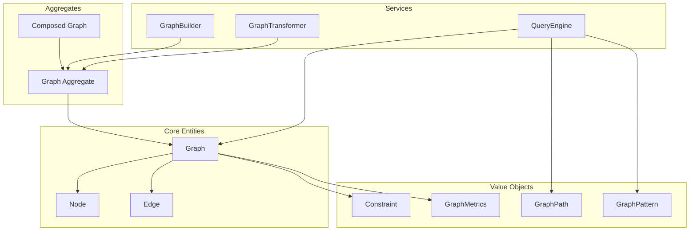

# CIM Graph Domain Model

## Overview

This document defines the complete domain model for the CIM Graph library, establishing the core entities, value objects, aggregates, and their relationships within the graph domain.

## Domain Context

The CIM Graph domain provides a unified abstraction for working with various graph types while preserving their semantic meaning and ensuring type safety.

## Core Domain Entities

### 1. Graph (Aggregate Root)

```rust
/// The primary aggregate root representing a graph structure
pub struct Graph<N, E, M> 
where
    N: Node,
    E: Edge,
    M: Metadata,
{
    id: GraphId,
    graph_type: GraphType,
    nodes: NodeCollection<N>,
    edges: EdgeCollection<E>,
    metadata: M,
    constraints: ConstraintSet,
    version: Version,
}

/// Unique identifier for graphs
pub struct GraphId(Uuid);

/// Supported graph types with their semantic properties
pub enum GraphType {
    Generic,
    IpldGraph,      // Content-addressed graph
    ContextGraph,   // Domain object relationships
    WorkflowGraph,  // State machine graph
    ConceptGraph,   // Semantic reasoning graph
    ComposedGraph,  // Multi-type composition
}
```

### 2. Node (Entity)

```rust
/// Base trait for all node types
pub trait Node: Clone + Debug {
    type Data;
    type Id: NodeId;
    
    fn id(&self) -> Self::Id;
    fn data(&self) -> &Self::Data;
    fn metadata(&self) -> &NodeMetadata;
}

/// Node identifier ensuring uniqueness within a graph
pub trait NodeId: Clone + Debug + Hash + Eq {
    fn new() -> Self;
    fn from_string(s: &str) -> Result<Self, NodeIdError>;
}

/// Common metadata for all nodes
pub struct NodeMetadata {
    created_at: Timestamp,
    updated_at: Timestamp,
    labels: HashSet<Label>,
    properties: PropertyMap,
}
```

### 3. Edge (Entity)

```rust
/// Base trait for all edge types
pub trait Edge: Clone + Debug {
    type Data;
    type Id: EdgeId;
    
    fn id(&self) -> Self::Id;
    fn source(&self) -> NodeId;
    fn target(&self) -> NodeId;
    fn data(&self) -> &Self::Data;
    fn metadata(&self) -> &EdgeMetadata;
}

/// Edge identifier ensuring uniqueness within a graph
pub trait EdgeId: Clone + Debug + Hash + Eq {
    fn new() -> Self;
    fn from_nodes(source: &NodeId, target: &NodeId) -> Self;
}

/// Common metadata for all edges
pub struct EdgeMetadata {
    created_at: Timestamp,
    weight: Option<f64>,
    direction: Direction,
    labels: HashSet<Label>,
    properties: PropertyMap,
}

pub enum Direction {
    Directed,
    Undirected,
    Bidirectional,
}
```

## Value Objects

### 1. GraphPath

```rust
/// Represents a path through the graph
pub struct GraphPath<N: NodeId> {
    nodes: Vec<N>,
    total_weight: f64,
    is_cycle: bool,
}

impl<N: NodeId> GraphPath<N> {
    pub fn length(&self) -> usize;
    pub fn contains_node(&self, node: &N) -> bool;
    pub fn subpath(&self, start: usize, end: usize) -> GraphPath<N>;
}
```

### 2. GraphPattern

```rust
/// Represents a pattern to match within graphs
pub struct GraphPattern {
    pattern_type: PatternType,
    node_criteria: Vec<NodeCriterion>,
    edge_criteria: Vec<EdgeCriterion>,
    structural_constraints: Vec<StructuralConstraint>,
}

pub enum PatternType {
    Subgraph,
    Motif,
    Path,
    Neighborhood,
    Component,
}
```

### 3. GraphMetrics

```rust
/// Computed metrics for a graph
pub struct GraphMetrics {
    node_count: usize,
    edge_count: usize,
    density: f64,
    diameter: Option<usize>,
    clustering_coefficient: f64,
    connected_components: usize,
    is_cyclic: bool,
    is_connected: bool,
}
```

### 4. Constraint

```rust
/// Constraints that can be applied to graphs
pub enum Constraint {
    Acyclic,
    Connected,
    MaxDegree(usize),
    MinDegree(usize),
    MaxNodes(usize),
    MaxEdges(usize),
    NodeValidator(Box<dyn Fn(&Node) -> bool>),
    EdgeValidator(Box<dyn Fn(&Edge) -> bool>),
    Custom(String, Box<dyn Fn(&Graph) -> ValidationResult>),
}
```

## Domain Aggregates

### 1. Graph Aggregate

The Graph aggregate ensures consistency of the entire graph structure:

```rust
impl<N, E, M> Graph<N, E, M> {
    /// Aggregate operations that maintain invariants
    pub fn add_node(&mut self, node: N) -> Result<NodeId, GraphError>;
    pub fn remove_node(&mut self, id: &NodeId) -> Result<N, GraphError>;
    pub fn add_edge(&mut self, edge: E) -> Result<EdgeId, GraphError>;
    pub fn remove_edge(&mut self, id: &EdgeId) -> Result<E, GraphError>;
    
    /// Ensures all constraints are satisfied
    fn validate_constraints(&self) -> Result<(), ConstraintViolation>;
    
    /// Maintains version history
    fn increment_version(&mut self);
}
```

### 2. ComposedGraph Aggregate

Manages relationships between multiple graph types:

```rust
pub struct ComposedGraph {
    id: GraphId,
    subgraphs: HashMap<GraphId, Box<dyn Graph>>,
    mappings: Vec<GraphMapping>,
    composition_metadata: CompositionMetadata,
}

pub struct GraphMapping {
    source: MappingEndpoint,
    target: MappingEndpoint,
    mapping_type: MappingType,
    bidirectional: bool,
}

pub struct MappingEndpoint {
    graph_id: GraphId,
    node_id: NodeId,
}
```

## Domain Services

### 1. GraphBuilder

```rust
/// Factory for creating graphs with proper initialization
pub struct GraphBuilder<N, E, M> {
    graph_type: GraphType,
    constraints: Vec<Constraint>,
    metadata: M,
}

impl<N, E, M> GraphBuilder<N, E, M> {
    pub fn new(graph_type: GraphType) -> Self;
    pub fn with_constraint(mut self, constraint: Constraint) -> Self;
    pub fn with_metadata(mut self, metadata: M) -> Self;
    pub fn build(self) -> Result<Graph<N, E, M>, BuildError>;
}
```

### 2. GraphTransformer

```rust
/// Service for transforming between graph types
pub trait GraphTransformer<S, T> {
    type Error;
    
    fn transform(&self, source: &Graph<S>) -> Result<Graph<T>, Self::Error>;
    fn can_transform(&self, source: &Graph<S>) -> bool;
}
```

### 3. GraphQueryEngine

```rust
/// Service for complex graph queries
pub struct GraphQueryEngine<G: Graph> {
    graph: Arc<G>,
    index: GraphIndex,
}

impl<G: Graph> GraphQueryEngine<G> {
    pub fn shortest_path(&self, from: NodeId, to: NodeId) -> Option<GraphPath>;
    pub fn find_patterns(&self, pattern: GraphPattern) -> Vec<Subgraph>;
    pub fn connected_components(&self) -> Vec<Component>;
    pub fn topological_sort(&self) -> Result<Vec<NodeId>, CycleError>;
}
```

## Repository Interfaces

### 1. GraphRepository

```rust
/// Repository for graph persistence
pub trait GraphRepository {
    type Error;
    
    fn save(&mut self, graph: &Graph) -> Result<(), Self::Error>;
    fn load(&self, id: &GraphId) -> Result<Graph, Self::Error>;
    fn delete(&mut self, id: &GraphId) -> Result<(), Self::Error>;
    fn find_by_type(&self, graph_type: GraphType) -> Vec<GraphId>;
}
```

### 2. GraphEventStore

```rust
/// Event sourcing for graph operations
pub trait GraphEventStore {
    fn append(&mut self, event: GraphEvent) -> Result<EventId, StoreError>;
    fn events_for(&self, graph_id: &GraphId) -> Vec<GraphEvent>;
    fn replay_to(&self, graph_id: &GraphId, version: Version) -> Graph;
}
```

## Domain Events

```rust
/// Events emitted by graph operations
pub enum GraphEvent {
    GraphCreated {
        id: GraphId,
        graph_type: GraphType,
        timestamp: Timestamp,
    },
    NodeAdded {
        graph_id: GraphId,
        node_id: NodeId,
        node_data: NodeData,
        timestamp: Timestamp,
    },
    EdgeAdded {
        graph_id: GraphId,
        edge_id: EdgeId,
        source: NodeId,
        target: NodeId,
        edge_data: EdgeData,
        timestamp: Timestamp,
    },
    GraphComposed {
        composed_id: GraphId,
        source_graphs: Vec<GraphId>,
        mappings: Vec<GraphMapping>,
        timestamp: Timestamp,
    },
    ConstraintViolated {
        graph_id: GraphId,
        constraint: Constraint,
        violation: ConstraintViolation,
        timestamp: Timestamp,
    },
}
```

## Invariants

### Graph Invariants

1. **Node Uniqueness**: Each node has a unique ID within the graph
2. **Edge Validity**: Every edge connects existing nodes
3. **Constraint Satisfaction**: All constraints are satisfied after each operation
4. **Type Safety**: Node and edge types match the graph type
5. **Referential Integrity**: Removing a node removes all connected edges

### Composition Invariants

1. **Mapping Validity**: Mappings only reference existing nodes
2. **Type Compatibility**: Only compatible types can be mapped
3. **Isolation**: Subgraphs maintain their individual constraints
4. **Consistency**: Composition preserves subgraph properties

## Domain Model Relationships



## Type-Specific Domain Models

### IpldGraph Domain

```rust
pub struct IpldNode {
    cid: Cid,
    data: IpldData,
    links: Vec<Link>,
}

pub struct IpldEdge {
    transition: Transition,
    probability: f64,
}
```

### ContextGraph Domain

```rust
pub struct ContextNode {
    entity: DomainEntity,
    bounded_context: BoundedContext,
    aggregate_root: bool,
}

pub struct ContextEdge {
    relationship: DomainRelationship,
    cardinality: Cardinality,
}
```

### WorkflowGraph Domain

```rust
pub struct WorkflowNode {
    state: WorkflowState,
    entry_actions: Vec<Action>,
    exit_actions: Vec<Action>,
}

pub struct WorkflowEdge {
    event: Event,
    guard: Option<Guard>,
    actions: Vec<Action>,
}
```

### ConceptGraph Domain

```rust
pub struct ConceptNode {
    concept: Concept,
    embedding: Vector,
    quality_dimensions: QualitySpace,
}

pub struct ConceptEdge {
    relation: SemanticRelation,
    strength: f64,
    context: Context,
}
```

## Usage Example

```rust
// Creating a domain graph
let graph = GraphBuilder::<ContextNode, ContextEdge, Metadata>::new(GraphType::ContextGraph)
    .with_constraint(Constraint::Acyclic)
    .with_constraint(Constraint::MaxNodes(1000))
    .build()?;

// Adding domain entities
let user_aggregate = ContextNode {
    entity: DomainEntity::User(user_id),
    bounded_context: BoundedContext::Identity,
    aggregate_root: true,
};

graph.add_node(user_aggregate)?;

// Querying the domain
let query_engine = GraphQueryEngine::new(&graph);
let aggregates = query_engine.find_patterns(
    GraphPattern::aggregate_roots()
);
```

## Next Steps

1. Implement core domain entities
2. Create type-specific implementations
3. Build domain services
4. Define repository interfaces
5. Set up event sourcing infrastructure