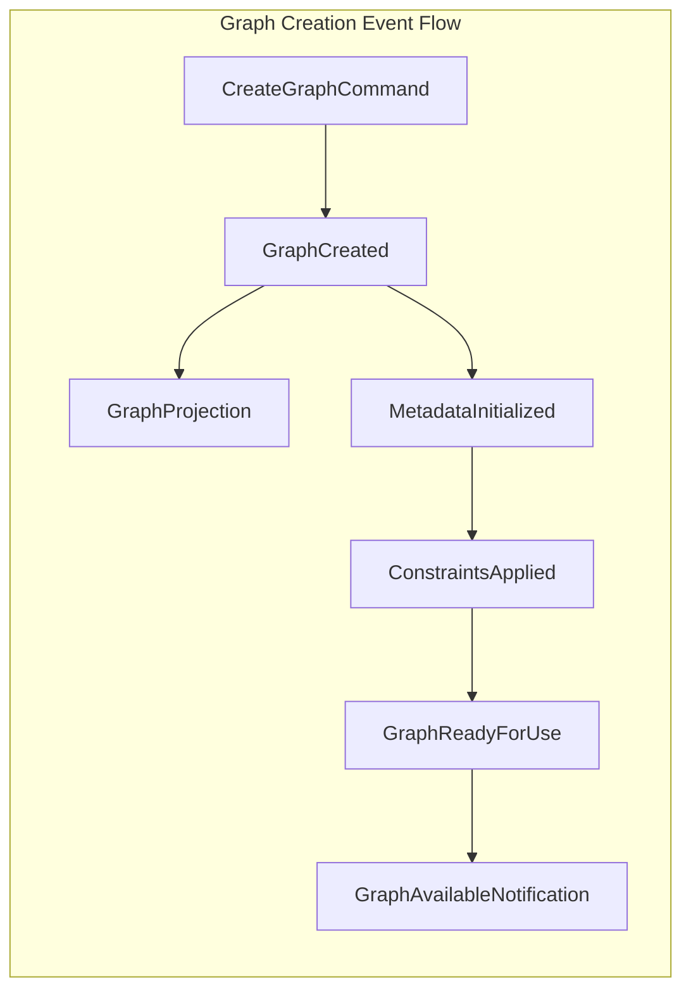
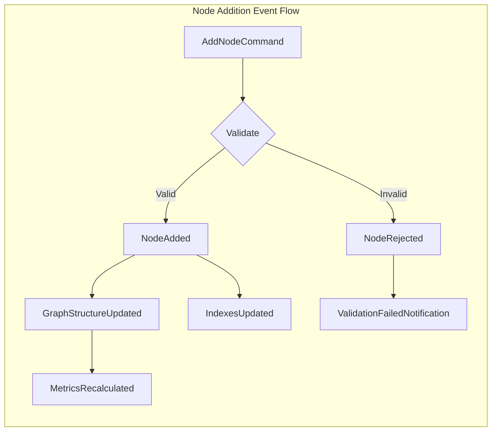
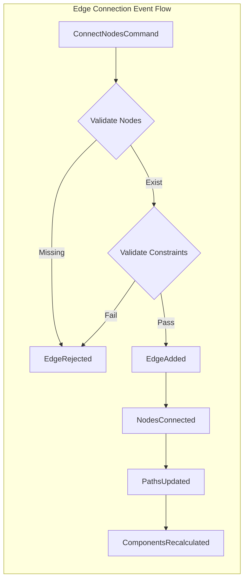
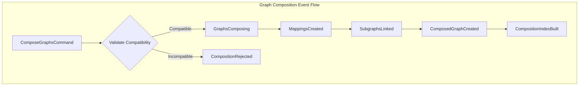
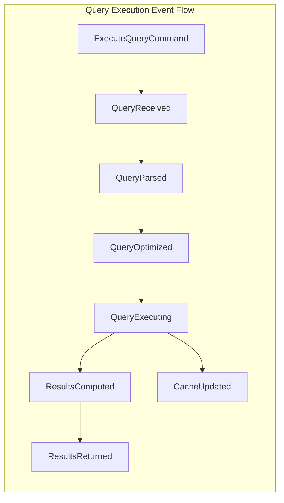
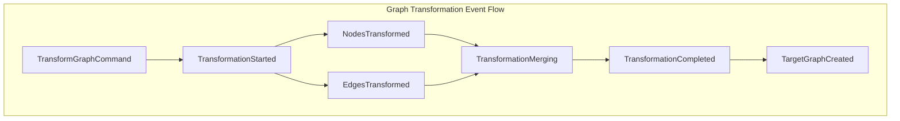
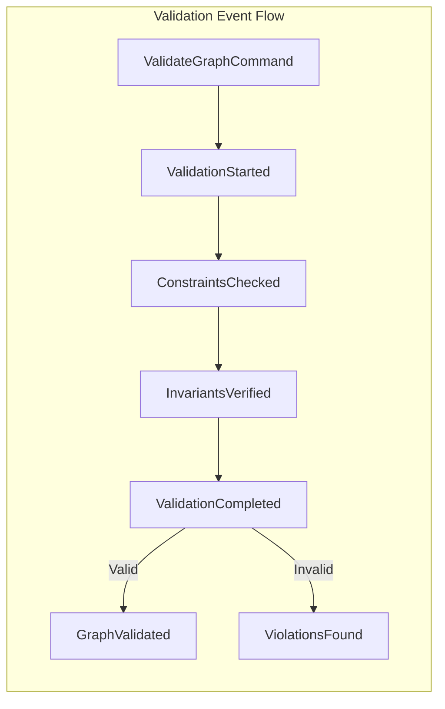
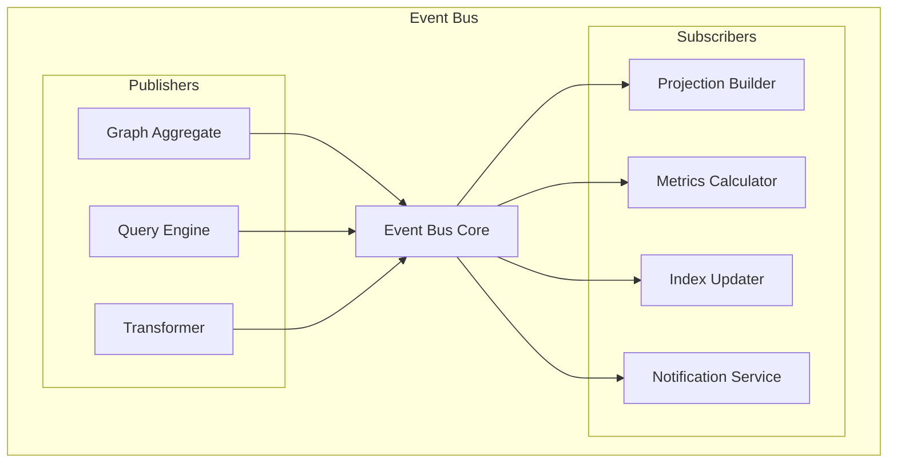

# CIM Graph Event Flows

## Overview

This document describes the event flows within the CIM Graph system, following Event-Driven Architecture (EDA) principles. Each flow is modeled as a directed graph showing event propagation, causation, and system state transitions.

## Event Flow Architecture

### Event Structure

```rust
pub struct GraphDomainEvent {
    event_id: EventId,
    aggregate_id: GraphId,
    event_type: EventType,
    payload: EventPayload,
    metadata: EventMetadata,
    causation_id: Option<EventId>,
    correlation_id: CorrelationId,
    timestamp: Timestamp,
}

pub struct EventMetadata {
    version: Version,
    actor: Actor,
    source: EventSource,
    tags: HashSet<String>,
}
```

## Core Event Flows

### 1. Graph Creation Flow



**Event Sequence**:

```graph
EventFlow {
    name: "GraphCreation",
    events: [
        {
            type: "GraphCreated",
            triggers: ["MetadataInitialized"],
            data: {
                graph_id: GraphId,
                graph_type: GraphType,
                initial_constraints: Vec<Constraint>
            }
        },
        {
            type: "MetadataInitialized",
            triggers: ["ConstraintsApplied"],
            data: {
                graph_id: GraphId,
                metadata: Metadata,
                version: "1.0.0"
            }
        },
        {
            type: "ConstraintsApplied",
            triggers: ["GraphReadyForUse"],
            data: {
                graph_id: GraphId,
                constraints: Vec<Constraint>,
                validation_result: ValidationResult
            }
        }
    ]
}
```

### 2. Node Addition Flow



**Event Sequence**:

```graph
EventFlow {
    name: "NodeAddition",
    events: [
        {
            type: "NodeAdded",
            preconditions: ["node_id_unique", "graph_exists"],
            triggers: ["GraphStructureUpdated", "IndexesUpdated"],
            data: {
                graph_id: GraphId,
                node_id: NodeId,
                node_data: NodeData,
                position: Option<Position>
            }
        },
        {
            type: "GraphStructureUpdated",
            triggers: ["MetricsRecalculated"],
            data: {
                graph_id: GraphId,
                node_count: usize,
                structure_version: Version
            }
        },
        {
            type: "IndexesUpdated",
            async: true,
            data: {
                graph_id: GraphId,
                index_type: IndexType,
                affected_nodes: Vec<NodeId>
            }
        }
    ]
}
```

### 3. Edge Connection Flow



**Event Sequence**:

```graph
EventFlow {
    name: "EdgeConnection",
    events: [
        {
            type: "EdgeAdded",
            preconditions: [
                "source_node_exists",
                "target_node_exists",
                "edge_constraints_satisfied"
            ],
            triggers: ["NodesConnected"],
            data: {
                graph_id: GraphId,
                edge_id: EdgeId,
                source: NodeId,
                target: NodeId,
                edge_data: EdgeData
            }
        },
        {
            type: "NodesConnected",
            triggers: ["PathsUpdated"],
            data: {
                graph_id: GraphId,
                source: NodeId,
                target: NodeId,
                connection_type: ConnectionType
            }
        },
        {
            type: "PathsUpdated",
            async: true,
            triggers: ["ComponentsRecalculated"],
            data: {
                graph_id: GraphId,
                affected_paths: Vec<PathId>,
                new_paths: Vec<GraphPath>
            }
        }
    ]
}
```

### 4. Graph Composition Flow



**Event Sequence**:

```graph
EventFlow {
    name: "GraphComposition",
    events: [
        {
            type: "GraphsComposing",
            triggers: ["MappingsCreated"],
            data: {
                composition_id: GraphId,
                source_graphs: Vec<GraphId>,
                composition_type: CompositionType
            }
        },
        {
            type: "MappingsCreated",
            triggers: ["SubgraphsLinked"],
            data: {
                composition_id: GraphId,
                mappings: Vec<GraphMapping>,
                validation_results: Vec<ValidationResult>
            }
        },
        {
            type: "ComposedGraphCreated",
            triggers: ["CompositionIndexBuilt"],
            data: {
                graph_id: GraphId,
                subgraph_count: usize,
                total_mappings: usize,
                composition_metadata: CompositionMetadata
            }
        }
    ]
}
```

### 5. Query Execution Flow



**Event Sequence**:

```graph
EventFlow {
    name: "QueryExecution",
    events: [
        {
            type: "QueryReceived",
            triggers: ["QueryParsed"],
            data: {
                query_id: QueryId,
                graph_id: GraphId,
                query_type: QueryType,
                parameters: QueryParameters
            }
        },
        {
            type: "QueryExecuting",
            triggers: ["ResultsComputed", "CacheUpdated"],
            parallel: true,
            data: {
                query_id: QueryId,
                execution_plan: ExecutionPlan,
                estimated_cost: Cost
            }
        },
        {
            type: "ResultsComputed",
            triggers: ["ResultsReturned"],
            data: {
                query_id: QueryId,
                result_set: ResultSet,
                execution_time: Duration,
                rows_examined: usize
            }
        }
    ]
}
```

### 6. Transformation Flow



**Event Sequence**:

```graph
EventFlow {
    name: "GraphTransformation",
    events: [
        {
            type: "TransformationStarted",
            triggers: ["NodesTransformed", "EdgesTransformed"],
            parallel: true,
            data: {
                transformation_id: TransformationId,
                source_graph: GraphId,
                target_type: GraphType,
                rules: TransformationRules
            }
        },
        {
            type: "NodesTransformed",
            triggers: ["TransformationMerging"],
            data: {
                transformation_id: TransformationId,
                nodes_processed: usize,
                nodes_transformed: usize,
                node_mappings: Vec<NodeMapping>
            }
        },
        {
            type: "TargetGraphCreated",
            data: {
                source_graph: GraphId,
                target_graph: GraphId,
                transformation_id: TransformationId,
                provenance: TransformationProvenance
            }
        }
    ]
}
```

### 7. Validation Flow



**Event Sequence**:

```graph
EventFlow {
    name: "GraphValidation",
    events: [
        {
            type: "ValidationStarted",
            triggers: ["ConstraintsChecked"],
            data: {
                validation_id: ValidationId,
                graph_id: GraphId,
                validation_rules: Vec<ValidationRule>
            }
        },
        {
            type: "ViolationsFound",
            data: {
                validation_id: ValidationId,
                graph_id: GraphId,
                violations: Vec<ConstraintViolation>,
                severity: Severity
            }
        }
    ]
}
```

## Event Choreography Patterns

### 1. Saga Pattern for Complex Operations

```graph
Saga {
    name: "GraphMigrationSaga",
    steps: [
        {
            action: "CreateTargetGraph",
            compensate: "DeleteTargetGraph",
            events: ["TargetGraphCreated", "CreationFailed"]
        },
        {
            action: "MigrateNodes",
            compensate: "RollbackNodes",
            events: ["NodesMigrated", "MigrationFailed"]
        },
        {
            action: "MigrateEdges",
            compensate: "RollbackEdges",
            events: ["EdgesMigrated", "MigrationFailed"]
        },
        {
            action: "ValidateTarget",
            compensate: "MarkInvalid",
            events: ["ValidationPassed", "ValidationFailed"]
        },
        {
            action: "SwitchToTarget",
            compensate: "RevertToSource",
            events: ["MigrationCompleted", "SwitchFailed"]
        }
    ]
}
```

### 2. Event Sourcing Pattern

```graph
EventSourcing {
    aggregate: "Graph",
    events: [
        "GraphCreated",
        "NodeAdded",
        "NodeRemoved",
        "EdgeAdded",
        "EdgeRemoved",
        "ConstraintAdded",
        "GraphTransformed"
    ],
    projections: [
        {
            name: "GraphStructureProjection",
            events: ["NodeAdded", "NodeRemoved", "EdgeAdded", "EdgeRemoved"]
        },
        {
            name: "GraphMetricsProjection",
            events: ["NodeAdded", "EdgeAdded", "GraphTransformed"]
        }
    ]
}
```

### 3. CQRS Command Handlers

```graph
CommandHandlers {
    commands: [
        {
            command: "CreateGraph",
            validates: ["unique_id", "valid_type"],
            emits: ["GraphCreated"]
        },
        {
            command: "AddNode",
            validates: ["graph_exists", "node_unique", "constraints"],
            emits: ["NodeAdded", "GraphStructureUpdated"]
        },
        {
            command: "ComposeGraphs",
            validates: ["graphs_exist", "compatible_types"],
            emits: ["GraphsComposing", "ComposedGraphCreated"]
        }
    ]
}
```

## Event Bus Architecture



## Error Handling Events

```graph
ErrorEvents {
    error_types: [
        {
            error: "ConstraintViolation",
            events: ["ConstraintViolated", "OperationRejected"],
            recovery: "Rollback"
        },
        {
            error: "ConcurrencyConflict",
            events: ["ConflictDetected", "RetryScheduled"],
            recovery: "OptimisticRetry"
        },
        {
            error: "ResourceExhausted",
            events: ["ResourceLimitReached", "OperationQueued"],
            recovery: "Backpressure"
        }
    ]
}
```

## Event Flow Testing

### Test Scenarios

```graph
TestScenarios {
    scenarios: [
        {
            name: "HappyPath",
            flow: ["CreateGraph", "AddNodes", "ConnectEdges", "QueryGraph"],
            assertions: ["all_events_emitted", "correct_order", "no_errors"]
        },
        {
            name: "ConstraintViolation",
            flow: ["CreateGraph", "AddCyclicEdge"],
            assertions: ["violation_detected", "rollback_completed"]
        },
        {
            name: "ConcurrentModification",
            flow: ["ParallelNodeAdditions"],
            assertions: ["no_duplicates", "all_processed"]
        }
    ]
}
```

## Performance Considerations

### Event Processing Metrics

```graph
PerformanceMetrics {
    metrics: [
        {
            name: "EventThroughput",
            target: "10000 events/second",
            measure: "events_processed / time"
        },
        {
            name: "EventLatency",
            target: "< 10ms p99",
            measure: "time_to_process_event"
        },
        {
            name: "EventOrdering",
            target: "100% correct",
            measure: "ordered_events / total_events"
        }
    ]
}
```

## Next Steps

1. Implement event bus infrastructure
2. Create event handlers for each flow
3. Set up event sourcing persistence
4. Build projection mechanisms
5. Implement saga orchestration
6. Create event flow monitoring