# CIM Graph Event Storming Session

Following the CIM Event Storming Guide, this document captures the event storming session for the cim-graph domain refactoring.

## Session Details

- **Date**: 2025-08-05
- **Domain**: Graph Management in CIM
- **Focus**: Event-driven graph operations
- **Participants**: Domain experts (conceptual)

## Phase 1: Chaotic Exploration

### Initial Event Discovery (Orange Sticky Notes)

Events discovered in no particular order:

```
Graph Created                    Node Added                      Edge Added
Graph Initialized               Node Removed                    Edge Removed  
CID Generated                   Node Data Updated               Edge Data Updated
CID Linked                      State Transitioned              Workflow Completed
Context Bounded                 Aggregate Defined               Entity Created
Value Object Attached           Relationship Established        Concept Defined
Property Inferred               Cluster Formed                  Reasoning Path Found
SubGraph Added                  Cross Graph Link Created        Query Executed
Projection Built                Event Applied                   Command Validated
State Machine Triggered         Policy Executed                 Snapshot Taken
CID Pinned                      CID Unpinned                   DAG Verified
Chain Validated                 Event Replayed                  Projection Cached
Collaboration Started           Client Subscribed               Event Published
```

## Phase 2: Timeline Enforcement

Organizing events chronologically:

```mermaid
flowchart LR
    Start([START]) --> GC[Graph Created]
    GC --> GI[Graph Initialized]
    GI --> NA[Node Added]
    NA --> EA[Edge Added]
    EA --> EP[Event Published]
    
    NA --> CG[CID Generated]
    CG --> CL[CID Linked]
    CL --> CV[Chain Validated]
    
    EP --> PB[Projection Built]
    PB --> PC[Projection Cached]
    
    PC --> CS[Client Subscribed]
    CS --> ER[Event Replayed]
    
    %% Start/Root Nodes (Dark Gray)
    style Start fill:#2D3436,stroke:#000,stroke-width:3px,color:#FFF
    
    %% Secondary Elements (Teal) - Events
    style GC fill:#4ECDC4,stroke:#2B8A89,stroke-width:3px,color:#FFF
    style GI fill:#4ECDC4,stroke:#2B8A89,stroke-width:3px,color:#FFF
    style NA fill:#4ECDC4,stroke:#2B8A89,stroke-width:3px,color:#FFF
    style EA fill:#4ECDC4,stroke:#2B8A89,stroke-width:3px,color:#FFF
    style EP fill:#4ECDC4,stroke:#2B8A89,stroke-width:3px,color:#FFF
    style CG fill:#4ECDC4,stroke:#2B8A89,stroke-width:3px,color:#FFF
    style CL fill:#4ECDC4,stroke:#2B8A89,stroke-width:3px,color:#FFF
    style CV fill:#4ECDC4,stroke:#2B8A89,stroke-width:3px,color:#FFF
    
    %% Results/Outcomes (Light Green)
    style PB fill:#95E1D3,stroke:#63C7B8,stroke-width:2px,color:#000
    style PC fill:#95E1D3,stroke:#63C7B8,stroke-width:2px,color:#000
    style CS fill:#95E1D3,stroke:#63C7B8,stroke-width:2px,color:#000
    style ER fill:#95E1D3,stroke:#63C7B8,stroke-width:2px,color:#000
```

### Parallel Flows Identified

1. **IPLD Flow**: CID Generated → CID Linked → DAG Verified
2. **DDD Flow**: Context Bounded → Aggregate Defined → Entity Created
3. **Workflow Flow**: State Transitioned → Policy Executed → Workflow Completed
4. **Reasoning Flow**: Concept Defined → Property Inferred → Reasoning Path Found

```mermaid
flowchart TB
    subgraph "IPLD Flow"
        CG1[CID Generated] --> CL1[CID Linked]
        CL1 --> DV1[DAG Verified]
    end
    
    subgraph "DDD Flow"
        CB2[Context Bounded] --> AD2[Aggregate Defined]
        AD2 --> EC2[Entity Created]
    end
    
    subgraph "Workflow Flow"
        ST3[State Transitioned] --> PE3[Policy Executed]
        PE3 --> WC3[Workflow Completed]
    end
    
    subgraph "Reasoning Flow"
        CD4[Concept Defined] --> PI4[Property Inferred]
        PI4 --> RP4[Reasoning Path Found]
    end
    
    %% Secondary Elements (Teal) - Events and Processing
    style CG1 fill:#4ECDC4,stroke:#2B8A89,stroke-width:3px,color:#FFF
    style CL1 fill:#4ECDC4,stroke:#2B8A89,stroke-width:3px,color:#FFF
    style CB2 fill:#4ECDC4,stroke:#2B8A89,stroke-width:3px,color:#FFF
    style AD2 fill:#4ECDC4,stroke:#2B8A89,stroke-width:3px,color:#FFF
    style ST3 fill:#4ECDC4,stroke:#2B8A89,stroke-width:3px,color:#FFF
    style PE3 fill:#4ECDC4,stroke:#2B8A89,stroke-width:3px,color:#FFF
    style CD4 fill:#4ECDC4,stroke:#2B8A89,stroke-width:3px,color:#FFF
    style PI4 fill:#4ECDC4,stroke:#2B8A89,stroke-width:3px,color:#FFF
    
    %% Results/Outcomes (Light Green)
    style DV1 fill:#95E1D3,stroke:#63C7B8,stroke-width:2px,color:#000
    style EC2 fill:#95E1D3,stroke:#63C7B8,stroke-width:2px,color:#000
    style WC3 fill:#95E1D3,stroke:#63C7B8,stroke-width:2px,color:#000
    style RP4 fill:#95E1D3,stroke:#63C7B8,stroke-width:2px,color:#000
```

## Phase 3: Commands Discovery (Blue Sticky Notes)

### Command-Event Pairs

```yaml
Commands → Events:
  # Graph Lifecycle
  Create Graph → Graph Created
  Initialize Graph → Graph Initialized
  
  # IPLD Operations
  Add CID → CID Generated + Node Added
  Link CIDs → CID Linked + Edge Added
  Pin CID → CID Pinned
  Unpin CID → CID Unpinned
  
  # Context Operations
  Create Bounded Context → Context Bounded
  Add Aggregate → Aggregate Defined
  Add Entity → Entity Created
  Attach Value Object → Value Object Attached
  
  # Workflow Operations
  Define Workflow → Workflow Created
  Add State → State Added
  Add Transition → Transition Added
  Trigger Transition → State Transitioned
  
  # Concept Operations
  Define Concept → Concept Defined
  Add Properties → Properties Added
  Add Relation → Relation Added
  Run Inference → Property Inferred
  
  # Composed Operations
  Add SubGraph → SubGraph Added
  Link Across Graphs → Cross Graph Link Created
```

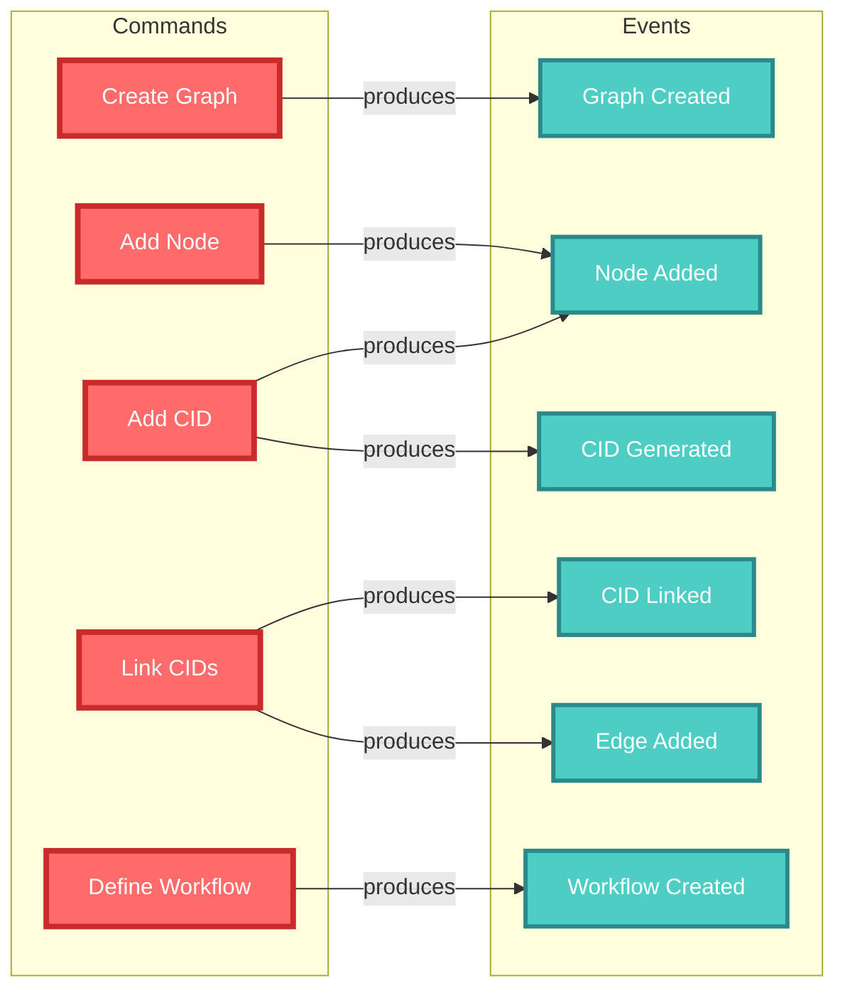

## Phase 4: Aggregate Identification (Yellow Sticky Notes)

### Core Aggregates

```yaml
Graph Aggregate:
  id: aggregate_id (UUID)
  commands:
    - Initialize Graph
    - Add Node
    - Add Edge
    - Remove Node
    - Remove Edge
  events:
    - Graph Initialized
    - Node Added
    - Edge Added
    - Node Removed
    - Edge Removed
  invariants:
    - Nodes must exist before edges can connect them
    - Graph type cannot change after initialization
    - All changes must go through state machine

IPLD Chain Aggregate:
  id: root_cid
  commands:
    - Add CID
    - Link CIDs
    - Pin CID
    - Verify Chain
  events:
    - CID Added
    - CID Linked
    - CID Pinned
    - Chain Verified
  invariants:
    - CIDs are immutable
    - Links form DAG (no cycles)
    - Previous CID must exist

Projection Aggregate:
  id: aggregate_id + version
  commands:
    - Build Projection
    - Cache Projection
    - Invalidate Cache
  events:
    - Projection Built
    - Projection Cached
    - Cache Invalidated
  invariants:
    - Projections are read-only
    - Version matches event sequence
    - Built from complete event stream
```

### Aggregate Relationships

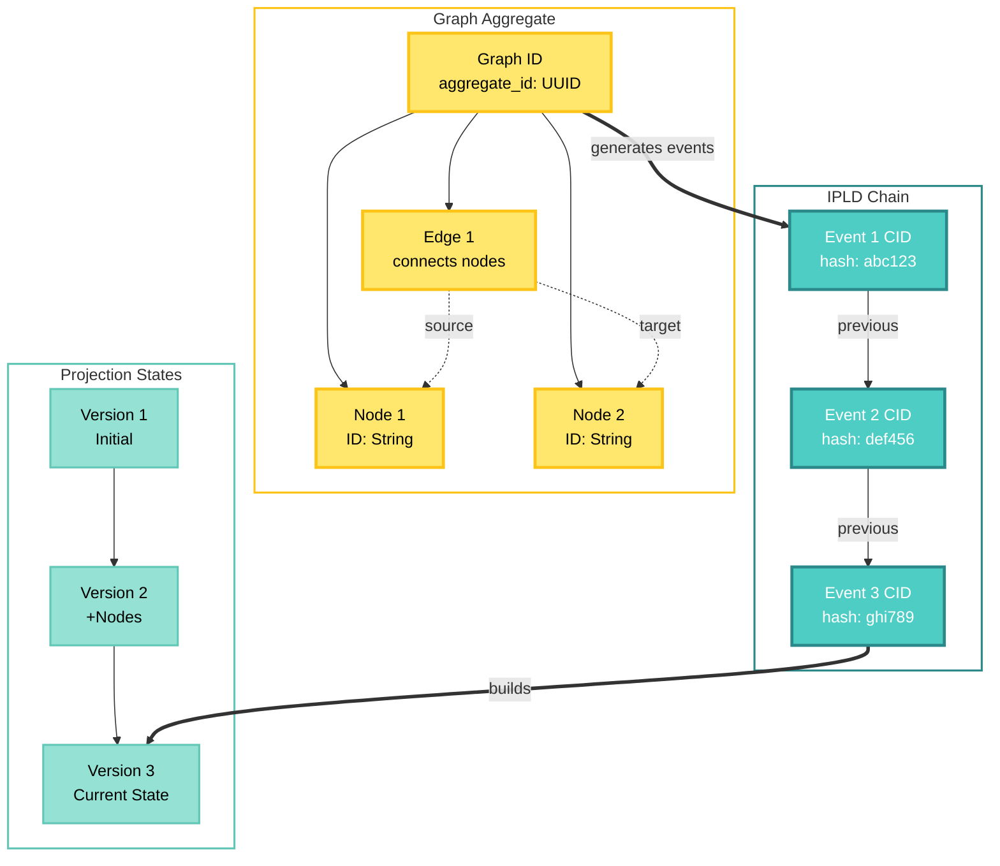

### Entity Discoveries

```yaml
Entities:
  Node:
    - id: String (CID for IPLD, UUID for others)
    - components: HashMap<String, Value>
    - belongs_to: Graph Aggregate
    
  Edge:
    - id: String
    - source: Node ID
    - target: Node ID
    - components: HashMap<String, Value>
    - belongs_to: Graph Aggregate
    
  EventPayload:
    - cid: CID (from cim-ipld)
    - data: Serialized event data
    - previous: Optional<CID>
    - belongs_to: IPLD Chain Aggregate
```

### Value Objects

```yaml
Value Objects:
  CID:
    - hash: String
    - codec: String
    - immutable: true
    
  GraphType:
    - enum: Generic | IPLD | Context | Workflow | Concept | Composed
    - immutable: true
    
  ComponentData:
    - type: String
    - value: JSON
    - immutable: true
    
  StateTransition:
    - from: State
    - to: State
    - trigger: Command
    - immutable: true
```

## Phase 5: Policy Discovery (Purple Sticky Notes)

### Automated Policies

```yaml
Policies:
  CID Generation Policy:
    trigger: Any Event Created
    action: Generate CID from event payload
    rules:
      - Use cim-ipld for generation
      - Include previous CID if exists
      - Store in event metadata
      
  Projection Update Policy:
    trigger: Event Published
    action: Update affected projections
    rules:
      - Only update projections for same aggregate
      - Maintain version consistency
      - Invalidate caches
      
  State Validation Policy:
    trigger: Command Received
    action: Validate against current state
    rules:
      - Check state machine rules
      - Verify invariants
      - Return error if invalid
      
  Chain Validation Policy:
    trigger: CID Chain Modified
    action: Verify chain integrity
    rules:
      - All CIDs must be valid
      - Links must form DAG
      - Previous references must exist
      
  Collaboration Policy:
    trigger: Client Subscribed
    action: Replay events from sequence
    rules:
      - Start from client's last known sequence
      - Send in order
      - Include all metadata
```

### Policy Flow Diagram

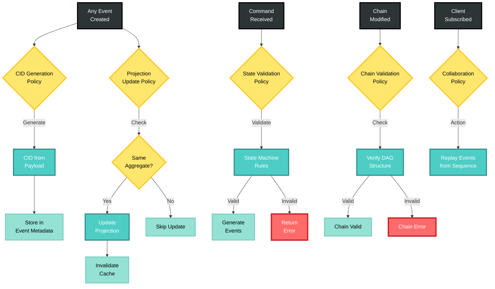

## Phase 6: Bounded Context Definition

### Context Map

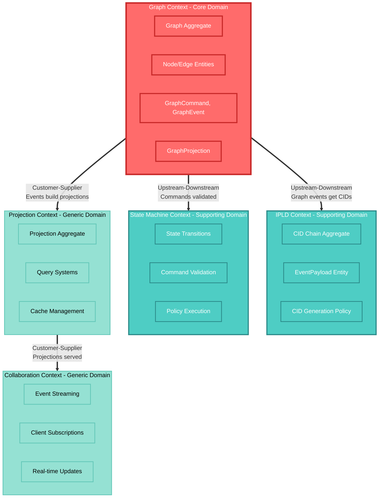

### Context Relationships

- **Graph → IPLD**: Graph events get CIDs from IPLD context
- **Graph → State Machine**: All commands validated by state machine
- **Graph → Projection**: Events build projections
- **Projection → Collaboration**: Projections served to clients

## Discovered Event Catalog

```yaml
# cim-graph-events.yaml
domain: CIM Graph
version: 2.0.0

aggregates:
  - name: Graph
    events:
      - name: GraphInitialized
        data:
          aggregate_id: UUID
          graph_type: GraphType
          metadata: Map<String, Value>
          
      - name: NodeAdded  
        data:
          node_id: String
          node_type: String
          data: JSON
          
      - name: EdgeAdded
        data:
          edge_id: String
          source_id: String  
          target_id: String
          edge_type: String
          data: JSON
          
      - name: NodeRemoved
        data:
          node_id: String
          
      - name: EdgeRemoved
        data:
          edge_id: String

  - name: IPLDChain
    events:
      - name: CIDGenerated
        data:
          event_id: UUID
          cid: CID
          payload_size: Integer
          
      - name: CIDLinked
        data:
          current_cid: CID
          previous_cid: CID
          sequence: Integer
          
      - name: ChainValidated
        data:
          root_cid: CID
          chain_length: Integer
          is_valid: Boolean
```

## State Machines Discovered

```rust
// Graph State Machine
enum GraphState {
    Uninitialized,
    Initialized { graph_type: GraphType },
    Active { nodes: usize, edges: usize },
    Archived,
}

// Valid Transitions
Uninitialized → Initialized (via InitializeGraph command)
Initialized → Active (via AddNode command)
Active → Active (via Add/Remove commands)
Active → Archived (via ArchiveGraph command)

// Workflow Instance State Machine  
enum WorkflowState {
    Draft,
    Published,
    Running { current_state: String },
    Completed,
    Failed { error: String },
}
```

### Graph State Machine Diagram

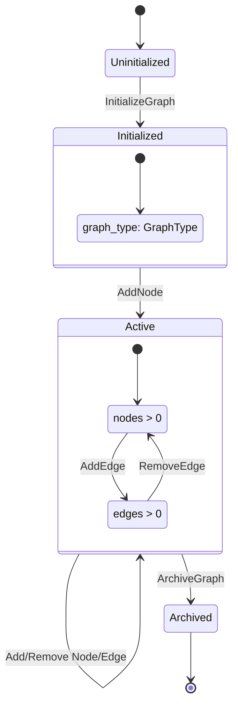

### Workflow State Machine Diagram

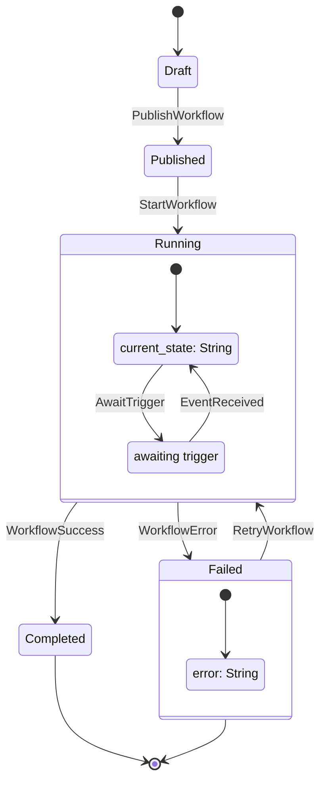

## Implementation Priority

Based on the event storming, implementation order should be:

1. **Core Event Infrastructure** (Foundation)
   - GraphEvent with correlation/causation
   - EventPayload definitions
   - Command definitions

2. **IPLD Integration** (Heart of storage)
   - CID generation for all payloads
   - Chain construction
   - DAG verification

3. **State Machine** (Control layer)
   - Command validation
   - State transitions
   - Policy execution

4. **Projections** (Read layer)
   - Fold events to state
   - Query systems
   - Cache management

5. **Collaboration** (Distribution)
   - NATS integration
   - Event streaming
   - Multi-client sync

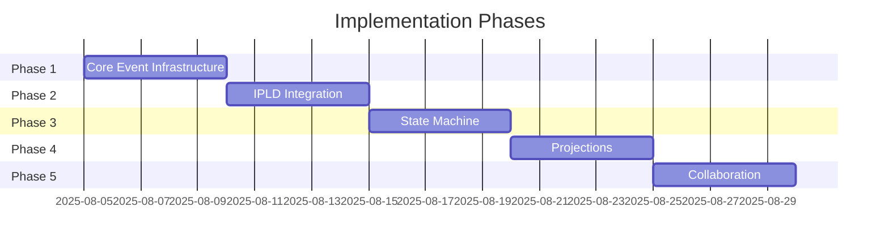

## Key Insights

1. **Everything is an Event** - No direct state changes
2. **CIDs are Central** - Every payload gets a CID
3. **Projections are Ephemeral** - Can rebuild from events
4. **State Machines Control** - All transitions validated
5. **Collaboration is Native** - Multi-client by design

### Complete Event Flow

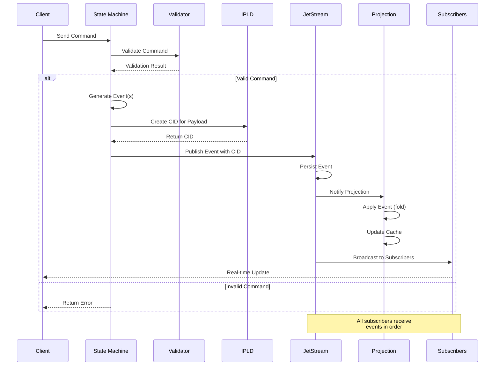

## Next Steps

1. Translate event catalog to Rust enums
2. Implement state machines
3. Create command handlers
4. Build projection engines
5. Integrate with NATS JetStream

---

*This event storming session revealed that graphs in CIM are not data structures but event streams with projections. This fundamental insight drives the entire refactoring.*

## Visual Summary

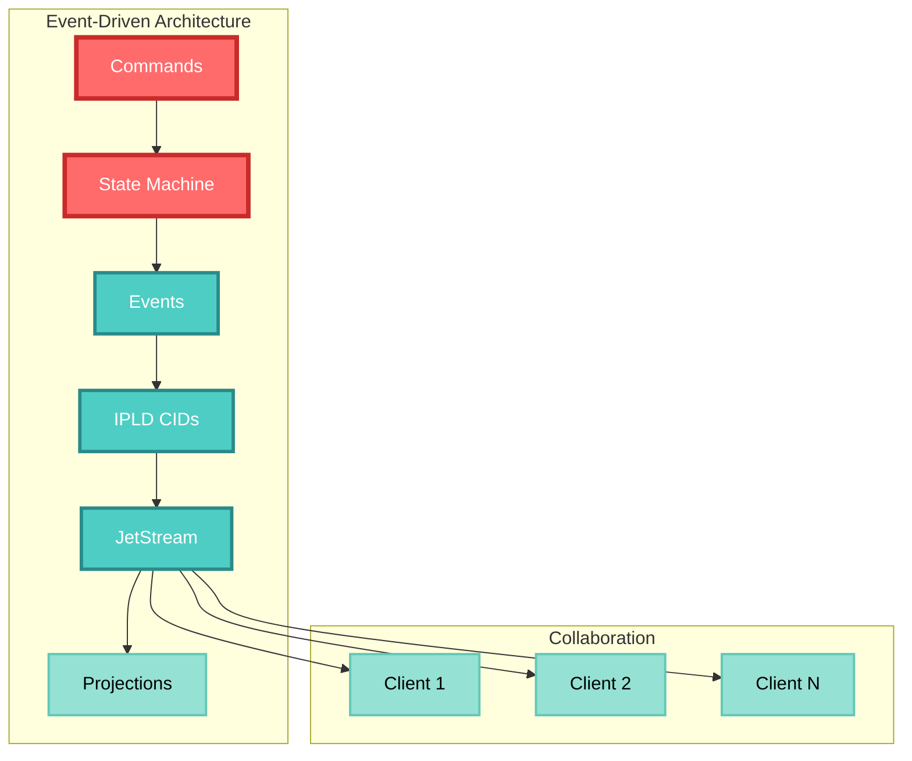