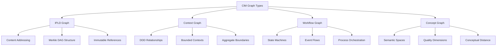
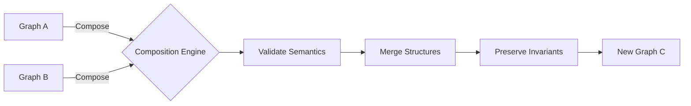

# CIM Graph Domain - Conceptual Model

## Living Graph Philosophy

In CIM, graphs are not passive data structures but **living information organisms** that:
- React to events in their environment
- Maintain their own integrity and coherence
- Communicate with other graphs through well-defined protocols
- Evolve over time through event-driven mutations

## Core Abstractions

### 1. Graph Identity

Every graph in CIM has a unique identity that persists across transformations:

```rust
pub struct GraphIdentity {
    pub id: Uuid,
    pub semantic_type: SemanticGraphType,
    pub birth_event: EventId,
    pub lineage: Vec<GraphId>,  // Parent graphs this was derived from
}
```

### 2. Semantic Graph Types

We recognize four fundamental graph types, each with its own semantic domain:



### 3. Graph Consciousness Model

Each graph maintains awareness of:
- **Self**: Its own structure and semantic meaning
- **Context**: The graphs it's connected to or composed with
- **History**: The events that shaped its current state
- **Purpose**: The domain problem it's solving

## Event-Driven Graph Lifecycle

### Graph Birth
```rust
pub enum GraphBirthEvent {
    Created { from_template: Option<GraphTemplate> },
    Derived { from_graphs: Vec<GraphId>, transformation: TransformationType },
    Imported { from_format: SerializationFormat, source: DataSource },
    Discovered { through_traversal: TraversalPath },
}
```

### Graph Evolution
```rust
pub enum GraphMutationEvent {
    NodeAdded { node: NodeData, caused_by: CausationContext },
    EdgeCreated { from: NodeId, to: NodeId, relationship: EdgeType },
    SubgraphMerged { other: GraphId, merge_strategy: MergeStrategy },
    TransformationApplied { transform: Transformation, preserving: Vec<Invariant> },
}
```

### Graph Communication
```rust
pub enum GraphCommunicationEvent {
    QueryReceived { query: GraphQuery, from: ActorId },
    TraversalRequested { pattern: TraversalPattern, purpose: Purpose },
    CompositionProposed { with: GraphId, strategy: CompositionStrategy },
    SemanticBridgeEstablished { to: GraphId, mapping: SemanticMapping },
}
```

## Semantic Integrity

### Invariants
Each graph type maintains specific invariants:

**IPLD Graphs**
- Content addresses are cryptographically valid
- All references resolve to valid CIDs
- Merkle tree structure is maintained

**Context Graphs**
- DDD boundaries are respected
- Aggregates maintain consistency
- Relationships follow domain rules

**Workflow Graphs**
- State transitions are valid
- No orphaned states exist
- Events form a valid Markov chain

**Concept Graphs**
- Semantic distances are metric
- Quality dimensions are orthogonal
- Conceptual regions are convex

### Composition Rules

When graphs compose, they must maintain semantic coherence:



## Graph Consciousness Levels

### Level 1: Structural Awareness
- Knows its nodes and edges
- Can report basic statistics
- Responds to direct queries

### Level 2: Semantic Awareness
- Understands what its structure means
- Can explain relationships
- Validates semantic constraints

### Level 3: Contextual Awareness
- Knows its place in the larger system
- Understands its connections to other graphs
- Can propose meaningful compositions

### Level 4: Evolutionary Awareness
- Tracks its own history
- Can explain why it exists
- Suggests its own transformations

## Implementation Philosophy

### No CRUD, Only Events
```rust
// ❌ Wrong - Direct manipulation
graph.add_node(node);
graph.remove_edge(edge_id);

// ✅ Correct - Event-driven
graph.handle(NodeAdditionRequested { node, reason });
graph.handle(EdgeRemovalProposed { edge_id, justification });
```

### Semantic First, Structure Second
```rust
// ❌ Wrong - Structure without meaning
let edge = Edge::new(from_id, to_id);

// ✅ Correct - Meaning drives structure
let relationship = SemanticRelationship::DependsOn { 
    strength: 0.8,
    domain_meaning: "requires for compilation" 
};
let edge = relationship.materialize_as_edge(from_id, to_id);
```

### Composition Over Modification
```rust
// ❌ Wrong - Mutate in place
workflow_graph.merge_with(concept_graph);

// ✅ Correct - Compose into new graph
let integrated = GraphComposer::new()
    .add_graph(workflow_graph)
    .add_graph(concept_graph)
    .with_semantic_bridge(bridge)
    .compose()?;
```

## Graph Domain Services

### 1. Graph Registry
- Tracks all living graphs in the system
- Maintains graph genealogy
- Provides graph discovery

### 2. Semantic Validator
- Ensures type-specific invariants
- Validates compositions
- Checks semantic coherence

### 3. Event Projector
- Maintains graph projections
- Provides query optimization
- Enables time-travel queries

### 4. Composition Engine
- Orchestrates graph merging
- Resolves semantic conflicts
- Preserves graph consciousness

## Next Steps

1. Define the event schema for graph operations
2. Design the trait hierarchy for graph types
3. Specify the composition algebra
4. Create semantic validation rules
5. Design the graph query language