# Graph Domain Events

> All graph operations MUST flow through these domain events. Direct manipulation is forbidden.

## Event Hierarchy

```mermaid
graph TD
    A[GraphDomainEvent] --> B[GraphLifecycleEvent]
    A --> C[GraphMutationEvent]
    A --> D[GraphQueryEvent]
    A --> E[GraphCompositionEvent]
    A --> F[GraphCommunicationEvent]
    
    B --> B1[GraphCreated]
    B --> B2[GraphDerived]
    B --> B3[GraphArchived]
    
    C --> C1[NodeAdded]
    C --> C2[EdgeCreated]
    C --> C3[PropertyRemoved]
    C --> C4[PropertyAdded]
    C --> C5[PropertyStateRecorded]
    C --> C6[SubgraphExtracted]
    
    D --> D1[TraversalRequested]
    D --> D2[PathQueryExecuted]
    D --> D3[SemanticSearchPerformed]
    
    E --> E1[GraphsMerged]
    E --> E2[GraphSplit]
    E --> E3[GraphTransformed]
    
    F --> F1[GraphsConnected]
    F --> F2[SemanticBridgeCreated]
    F --> F3[GraphSynchronized]
```



## Core Event Definitions

### Base Event Structure

```rust
pub trait GraphDomainEvent: Event {
    fn graph_id(&self) -> GraphId;
    fn semantic_context(&self) -> SemanticContext;
    fn invariants_preserved(&self) -> Vec<Invariant>;
}

pub struct EventMetadata {
    pub event_id: Uuid,
    pub correlation_id: Uuid,
    pub causation_id: Uuid,
    pub timestamp: DateTime<Utc>,
    pub actor: ActorId,
    pub semantic_intent: String,
}
```

### Graph Lifecycle Events

```rust
#[derive(Debug, Clone, Serialize, Deserialize)]
pub struct GraphCreated {
    pub metadata: EventMetadata,
    pub graph_id: GraphId,
    pub graph_type: SemanticGraphType,
    pub initial_state: GraphSnapshot,
    pub creation_context: CreationContext,
}

#[derive(Debug, Clone, Serialize, Deserialize)]
pub struct GraphDerived {
    pub metadata: EventMetadata,
    pub new_graph_id: GraphId,
    pub parent_graphs: Vec<GraphId>,
    pub derivation_type: DerivationType,
    pub transformation_proof: TransformationProof,
}

#[derive(Debug, Clone, Serialize, Deserialize)]
pub enum DerivationType {
    Projection { dimensions: Vec<Dimension> },
    Aggregation { strategy: AggregationStrategy },
    Transformation { algorithm: TransformAlgorithm },
    Composition { rules: CompositionRules },
}
```

### Graph Mutation Events

```rust
#[derive(Debug, Clone, Serialize, Deserialize)]
pub struct NodeAdded {
    pub metadata: EventMetadata,
    pub graph_id: GraphId,
    pub node_id: NodeId,
    pub node_data: NodeData,
    pub semantic_role: SemanticRole,
    pub connection_hints: Vec<ConnectionHint>,
}

#[derive(Debug, Clone, Serialize, Deserialize)]
pub struct EdgeCreated {
    pub metadata: EventMetadata,
    pub graph_id: GraphId,
    pub edge_id: EdgeId,
    pub from_node: NodeId,
    pub to_node: NodeId,
    pub relationship: SemanticRelationship,
    pub edge_properties: HashMap<String, Value>,
}

#[derive(Debug, Clone, Serialize, Deserialize)]
pub struct PropertyRemoved {
    pub metadata: EventMetadata,
    pub graph_id: GraphId,
    pub target: PropertyTarget,
    pub property_path: PropertyPath,
    pub value: Value,
    pub removal_reason: RemovalReason,
}

#[derive(Debug, Clone, Serialize, Deserialize)]
pub struct PropertyAdded {
    pub metadata: EventMetadata,
    pub graph_id: GraphId,
    pub target: PropertyTarget,
    pub property_path: PropertyPath,
    pub value: Value,
    pub semantic_meaning: SemanticMeaning,
}

#[derive(Debug, Clone, Serialize, Deserialize)]
pub struct PropertyStateRecorded {
    pub metadata: EventMetadata,
    pub graph_id: GraphId,
    pub target: PropertyTarget,
    pub property_path: PropertyPath,
    pub value: Value,
    pub effective_from: DateTime<Utc>,
    pub semantic_context: SemanticContext,
}
```

### Graph Query Events

```rust
#[derive(Debug, Clone, Serialize, Deserialize)]
pub struct TraversalRequested {
    pub metadata: EventMetadata,
    pub graph_id: GraphId,
    pub start_nodes: Vec<NodeId>,
    pub traversal_pattern: TraversalPattern,
    pub semantic_filter: Option<SemanticFilter>,
    pub depth_limit: Option<usize>,
}

#[derive(Debug, Clone, Serialize, Deserialize)]
pub struct PathQueryExecuted {
    pub metadata: EventMetadata,
    pub graph_id: GraphId,
    pub path_pattern: PathPattern,
    pub constraints: Vec<PathConstraint>,
    pub optimization_hints: Vec<OptimizationHint>,
}

#[derive(Debug, Clone, Serialize, Deserialize)]
pub struct SemanticSearchPerformed {
    pub metadata: EventMetadata,
    pub graph_id: GraphId,
    pub semantic_query: SemanticQuery,
    pub embedding_space: EmbeddingSpace,
    pub similarity_threshold: f64,
}
```

### Graph Composition Events

```rust
#[derive(Debug, Clone, Serialize, Deserialize)]
pub struct GraphsMerged {
    pub metadata: EventMetadata,
    pub source_graphs: Vec<GraphId>,
    pub result_graph: GraphId,
    pub merge_strategy: MergeStrategy,
    pub conflict_resolutions: Vec<ConflictResolution>,
    pub semantic_mappings: Vec<SemanticMapping>,
}

#[derive(Debug, Clone, Serialize, Deserialize)]
pub struct GraphSplit {
    pub metadata: EventMetadata,
    pub source_graph: GraphId,
    pub result_graphs: Vec<GraphId>,
    pub split_criteria: SplitCriteria,
    pub boundary_handling: BoundaryStrategy,
}

#[derive(Debug, Clone, Serialize, Deserialize)]
pub struct GraphTransformed {
    pub metadata: EventMetadata,
    pub source_graph: GraphId,
    pub result_graph: GraphId,
    pub transformation: GraphTransformation,
    pub invariants_preserved: Vec<Invariant>,
    pub properties_mapped: Vec<PropertyMapping>,
}
```

## Semantic Context

Every event carries semantic context to preserve meaning:

```rust
pub struct SemanticContext {
    pub domain: DomainIdentifier,
    pub intent: SemanticIntent,
    pub constraints: Vec<SemanticConstraint>,
    pub quality_dimensions: HashMap<String, f64>,
}

pub enum SemanticIntent {
    Explore { purpose: String },
    Integrate { goal: String },
    Optimize { metric: String },
    Validate { rules: Vec<ValidationRule> },
    Transform { target_form: String },
}
```

## Event Validation

All events must pass semantic validation:

```rust
pub trait EventValidator {
    fn validate_preconditions(&self, event: &dyn GraphDomainEvent) -> Result<(), ValidationError>;
    fn validate_invariants(&self, event: &dyn GraphDomainEvent) -> Result<(), ValidationError>;
    fn validate_semantics(&self, event: &dyn GraphDomainEvent) -> Result<(), ValidationError>;
}
```

## Event Handlers

Each graph type implements specific handlers:

```rust
pub trait GraphEventHandler {
    type Event: GraphDomainEvent;
    type State: GraphState;
    type Error: Error;
    
    fn handle_event(
        &mut self,
        event: Self::Event,
        state: &Self::State,
    ) -> Result<Vec<DomainEvent>, Self::Error>;
    
    fn validate_event(
        &self,
        event: &Self::Event,
        state: &Self::State,
    ) -> Result<(), Self::Error>;
}
```

## Event Sourcing Integration

All events are persisted for full auditability:

```rust
pub struct GraphEventStore {
    pub stream_id: StreamId,
    pub events: Vec<PersistedEvent<GraphDomainEvent>>,
    pub snapshots: Vec<GraphSnapshot>,
    pub projections: HashMap<ProjectionId, Projection>,
}
```

## Event Patterns

### Command-Event Pattern
```rust
// Command (intent)
pub struct AddNodeCommand {
    pub graph_id: GraphId,
    pub node_data: NodeData,
    pub reason: String,
}

// Validation
impl CommandValidator for AddNodeCommand {
    fn validate(&self) -> Result<(), ValidationError> {
        // Check graph exists
        // Validate node data
        // Check permissions
    }
}

// Event (fact)
impl From<AddNodeCommand> for NodeAdded {
    fn from(cmd: AddNodeCommand) -> Self {
        NodeAdded {
            metadata: EventMetadata::new(),
            graph_id: cmd.graph_id,
            node_data: cmd.node_data,
            // ...
        }
    }
}
```

### Event Correlation
```rust
// Starting a graph transformation workflow
let correlation_id = Uuid::new_v4();

let events = vec![
    GraphTransformationStarted { 
        metadata: EventMetadata::with_correlation(correlation_id),
        // ...
    },
    NodesFiltered {
        metadata: EventMetadata::with_correlation(correlation_id),
        // ...
    },
    EdgesRecomputed {
        metadata: EventMetadata::with_correlation(correlation_id),
        // ...
    },
    GraphTransformationCompleted {
        metadata: EventMetadata::with_correlation(correlation_id),
        // ...
    },
];
```