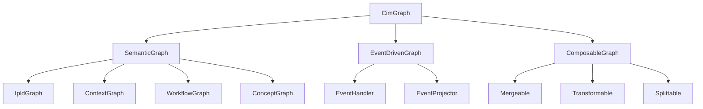

# Graph Trait System

> The trait system provides a unified interface while preserving the semantic richness of each graph type.

## Core Trait Hierarchy



## Base Graph Trait

```rust
/// The fundamental trait all CIM graphs implement
/// ALL GRAPHS MUST BE VALID MATHEMATICAL OBJECTS
pub trait CimGraph: Send + Sync + MathematicalGraph {
    /// The node type for this graph
    type Node: GraphNode;
    
    /// The edge type for this graph
    type Edge: GraphEdge;
    
    /// The semantic metadata type
    type Metadata: SemanticMetadata;
    
    /// Mathematical proof of graph validity
    type Proof: GraphProof;
    
    /// Unique identifier for this graph instance
    fn id(&self) -> GraphId;
    
    /// The semantic type of this graph
    fn semantic_type(&self) -> SemanticGraphType;
    
    /// Get the graph's current state as an event-sourced projection
    fn current_state(&self) -> GraphState<Self::Node, Self::Edge>;
    
    /// Handle a domain event
    fn handle_event(&mut self, event: GraphDomainEvent) -> Result<EventHandled, GraphError>;
    
    /// Query the graph
    fn query(&self, query: GraphQuery) -> Result<QueryResult, QueryError>;
    
    /// Validate graph invariants (mathematical + semantic)
    fn validate(&self) -> Result<ValidationReport, ValidationError> {
        // First verify mathematical properties
        self.verify_graph_axioms()?;
        self.verify_network_properties()?;
        
        // Then semantic validation
        self.validate_semantic_invariants()
    }
    
    /// Export to common format
    fn export(&self, format: ExportFormat) -> Result<ExportedGraph, ExportError>;
}
```

## Semantic Graph Types

Each graph type has specific semantic constraints:

```rust
/// IPLD Graph - Content-addressed Merkle DAG
pub trait IpldGraph: CimGraph {
    type Cid: ContentIdentifier;
    
    /// Get the root CID of the graph
    fn root_cid(&self) -> Self::Cid;
    
    /// Resolve a path through the graph
    fn resolve_path(&self, path: &IpldPath) -> Result<ResolvedNode, ResolutionError>;
    
    /// Compute the Merkle proof for a node
    fn merkle_proof(&self, node_id: NodeId) -> MerkleProof;
    
    /// Verify content integrity
    fn verify_integrity(&self) -> Result<IntegrityReport, IntegrityError>;
}

/// Context Graph - Domain-Driven Design relationships
pub trait ContextGraph: CimGraph {
    type BoundedContext: DomainContext;
    type Aggregate: AggregateRoot;
    
    /// Get the bounded context this graph represents
    fn bounded_context(&self) -> &Self::BoundedContext;
    
    /// Find aggregate boundaries
    fn aggregate_boundaries(&self) -> Vec<AggregateBoundary>;
    
    /// Validate DDD constraints
    fn validate_ddd_rules(&self) -> Result<DddValidation, DddError>;
    
    /// Project to read model
    fn project_read_model<R: ReadModel>(&self) -> R;
}

/// Workflow Graph - State machines and process flows
pub trait WorkflowGraph: CimGraph {
    type State: WorkflowState;
    type Transition: StateTransition;
    
    /// Get current workflow state
    fn current_states(&self) -> Vec<Self::State>;
    
    /// Find valid transitions from a state
    fn valid_transitions(&self, from: &Self::State) -> Vec<Self::Transition>;
    
    /// Execute a workflow transition
    fn execute_transition(&mut self, transition: Self::Transition) -> Result<TransitionResult, WorkflowError>;
    
    /// Compute reachability
    fn reachable_states(&self, from: &Self::State) -> HashSet<Self::State>;
}

/// Concept Graph - Semantic reasoning in conceptual spaces
pub trait ConceptGraph: CimGraph {
    type Concept: ConceptualEntity;
    type QualityDimension: Dimension;
    
    /// Get the conceptual space dimensions
    fn quality_dimensions(&self) -> &[Self::QualityDimension];
    
    /// Compute semantic distance between concepts
    fn semantic_distance(&self, a: &Self::Concept, b: &Self::Concept) -> f64;
    
    /// Find concepts in a region
    fn concepts_in_region(&self, region: ConceptualRegion) -> Vec<Self::Concept>;
    
    /// Perform semantic inference
    fn infer_relations(&self, concept: &Self::Concept) -> Vec<InferredRelation>;
}
```

## Composition Traits

Graphs can be composed while preserving semantics:

```rust
/// Trait for graphs that can be merged
pub trait Mergeable: CimGraph {
    type MergeStrategy: MergeStrategy;
    
    fn can_merge_with(&self, other: &dyn CimGraph) -> bool;
    
    fn merge_with(
        self,
        other: Self,
        strategy: Self::MergeStrategy,
    ) -> Result<Self, MergeError>
    where
        Self: Sized;
}

/// Trait for graphs that can be transformed
pub trait Transformable: CimGraph {
    type Transformation: GraphTransformation;
    
    fn applicable_transformations(&self) -> Vec<Self::Transformation>;
    
    fn transform(
        self,
        transformation: Self::Transformation,
    ) -> Result<TransformedGraph, TransformError>
    where
        Self: Sized;
}

/// Trait for graphs that can be split
pub trait Splittable: CimGraph {
    type SplitCriteria: SplitCriteria;
    
    fn find_split_points(&self, criteria: Self::SplitCriteria) -> Vec<SplitPoint>;
    
    fn split_at(
        self,
        split_points: Vec<SplitPoint>,
    ) -> Result<Vec<Self>, SplitError>
    where
        Self: Sized;
}
```

## Node and Edge Traits

```rust
/// Base trait for graph nodes
pub trait GraphNode: Clone + Send + Sync {
    type Id: NodeIdentifier;
    type Data: NodeData;
    
    fn id(&self) -> Self::Id;
    fn data(&self) -> &Self::Data;
    fn semantic_type(&self) -> NodeSemanticType;
    fn metadata(&self) -> &NodeMetadata;
}

/// Base trait for graph edges
pub trait GraphEdge: Clone + Send + Sync {
    type Id: EdgeIdentifier;
    type Relationship: SemanticRelationship;
    
    fn id(&self) -> Self::Id;
    fn from(&self) -> NodeId;
    fn to(&self) -> NodeId;
    fn relationship(&self) -> &Self::Relationship;
    fn weight(&self) -> Option<f64>;
    fn metadata(&self) -> &EdgeMetadata;
}
```

## Query Traits

```rust
/// Trait for graph querying capabilities
pub trait Queryable: CimGraph {
    type Query: GraphQuery;
    type Result: QueryResult;
    
    fn execute_query(&self, query: Self::Query) -> Result<Self::Result, QueryError>;
    
    fn supports_query_type(&self, query_type: QueryType) -> bool;
    
    fn optimize_query(&self, query: Self::Query) -> OptimizedQuery;
}

/// Trait for semantic search
pub trait SemanticSearchable: CimGraph {
    type Embedding: VectorEmbedding;
    
    fn embed_node(&self, node: &Self::Node) -> Self::Embedding;
    
    fn semantic_search(
        &self,
        query_embedding: Self::Embedding,
        k: usize,
    ) -> Vec<(Self::Node, f64)>;
}
```

## Serialization Traits

```rust
/// Trait for JSON serialization
pub trait JsonSerializable: CimGraph {
    fn to_json(&self) -> Result<serde_json::Value, SerializationError>;
    
    fn from_json(json: serde_json::Value) -> Result<Self, DeserializationError>
    where
        Self: Sized;
}

/// Trait for Nix expression generation
pub trait NixExpressionable: CimGraph {
    fn to_nix_expr(&self) -> String;
    
    fn to_nix_derivation(&self) -> NixDerivation;
}
```

## Implementation Example

```rust
/// Example implementation for a unified graph wrapper
pub struct UnifiedGraph<G: CimGraph> {
    inner: G,
    event_log: EventLog,
    projections: ProjectionCache,
}

impl<G: CimGraph> CimGraph for UnifiedGraph<G> {
    type Node = G::Node;
    type Edge = G::Edge;
    type Metadata = G::Metadata;
    
    fn id(&self) -> GraphId {
        self.inner.id()
    }
    
    fn semantic_type(&self) -> SemanticGraphType {
        self.inner.semantic_type()
    }
    
    fn handle_event(&mut self, event: GraphDomainEvent) -> Result<EventHandled, GraphError> {
        // Log event
        self.event_log.append(event.clone());
        
        // Validate event
        self.validate_event(&event)?;
        
        // Handle in inner graph
        let result = self.inner.handle_event(event)?;
        
        // Update projections
        self.projections.update(&result);
        
        Ok(result)
    }
    
    // ... other trait methods
}
```

## Type-Safe Graph Operations

```rust
/// Type-safe graph composition
pub fn compose_graphs<A, B, C>(
    graph_a: A,
    graph_b: B,
    composer: C,
) -> Result<ComposedGraph, CompositionError>
where
    A: CimGraph + Mergeable,
    B: CimGraph + Mergeable,
    C: GraphComposer<A, B>,
{
    composer.compose(graph_a, graph_b)
}

/// Type-safe transformation
pub fn transform_graph<G, T>(
    graph: G,
    transformation: T,
) -> Result<G::Output, TransformError>
where
    G: Transformable<Transformation = T>,
    T: GraphTransformation,
{
    graph.transform(transformation)
}
```

## Trait Bounds for Safety

```rust
/// Ensure graphs can be safely composed
pub trait SafelyComposable: CimGraph + Send + Sync + 'static {
    fn composition_invariants(&self) -> Vec<Invariant>;
    
    fn validate_composition_with<Other: SafelyComposable>(
        &self,
        other: &Other,
    ) -> Result<(), CompositionError>;
}

/// Ensure transformations preserve semantics
pub trait SemanticPreserving: Transformable {
    fn semantic_fingerprint(&self) -> SemanticHash;
    
    fn verify_semantics_preserved<T: GraphTransformation>(
        &self,
        after_transform: &Self,
        transformation: &T,
    ) -> bool;
}
```

This trait system provides:
1. **Type Safety**: Each graph type maintains its specific semantics
2. **Composability**: Graphs can be combined when semantically valid
3. **Extensibility**: New graph types can be added by implementing traits
4. **Event-Driven**: All operations flow through events
5. **Semantic Preservation**: Type system ensures meaning is maintained