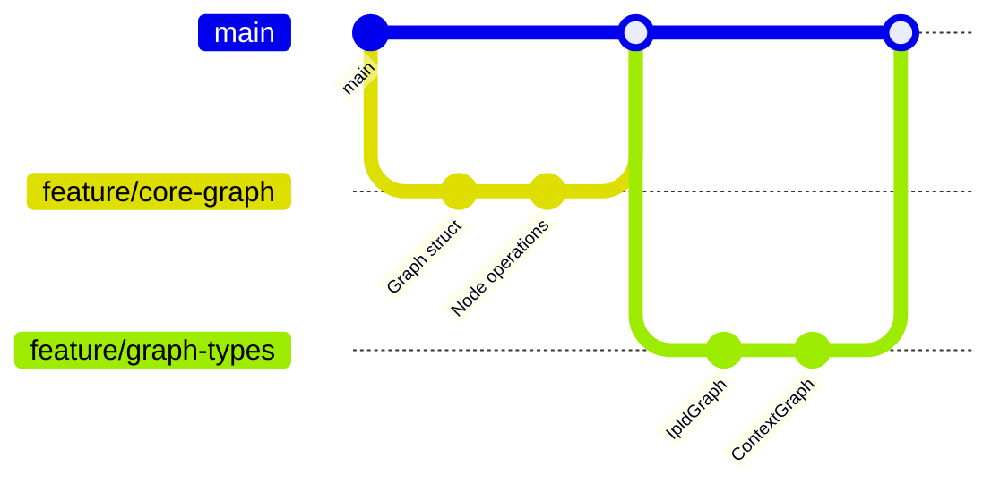

# CIM Graph Implementation Plan

## Overview

This document outlines the implementation plan for the CIM Graph library based on the user stories and design specifications. The plan follows a phased approach with clear milestones and dependencies.

## Implementation Phases

### Phase 1: Core Foundation (Weeks 1-2)

**Goal**: Establish the basic graph structure and operations

#### Sprint 1.1: Basic Graph Infrastructure
```graph
ImplementationGraph {
    tasks: [
        {
            id: "T1.1",
            story: "US-001",
            description: "Implement base Graph struct and traits",
            estimate: "2 days",
            dependencies: []
        },
        {
            id: "T1.2", 
            story: "US-001",
            description: "Create GraphBuilder factory",
            estimate: "1 day",
            dependencies: ["T1.1"]
        },
        {
            id: "T1.3",
            story: "US-002",
            description: "Implement node storage and operations",
            estimate: "2 days",
            dependencies: ["T1.1"]
        }
    ]
}
```

**Deliverables**:
- Core `Graph<N, E, M>` generic structure
- `Node` and `Edge` traits
- `GraphBuilder` for graph construction
- Basic node addition/removal

#### Sprint 1.2: Edge Operations and Queries
```graph
ImplementationGraph {
    tasks: [
        {
            id: "T1.4",
            story: "US-003",
            description: "Implement edge storage and connections",
            estimate: "2 days",
            dependencies: ["T1.3"]
        },
        {
            id: "T1.5",
            story: "US-004",
            description: "Basic graph traversal algorithms",
            estimate: "3 days",
            dependencies: ["T1.4"]
        },
        {
            id: "T1.6",
            story: "US-004",
            description: "Implement neighbor queries",
            estimate: "1 day",
            dependencies: ["T1.5"]
        }
    ]
}
```

**Deliverables**:
- Edge creation and management
- Basic query operations
- Neighbor traversal
- Path finding basics

### Phase 2: Type-Specific Implementations (Weeks 3-4)

**Goal**: Implement specialized graph types

#### Sprint 2.1: Specialized Graph Types
```graph
ImplementationGraph {
    tasks: [
        {
            id: "T2.1",
            description: "Implement IpldGraph with CID nodes",
            estimate: "3 days",
            dependencies: ["T1.6"]
        },
        {
            id: "T2.2",
            description: "Implement ContextGraph for DDD",
            estimate: "3 days",
            dependencies: ["T1.6"]
        },
        {
            id: "T2.3",
            description: "Implement WorkflowGraph for state machines",
            estimate: "2 days",
            dependencies: ["T1.6"]
        },
        {
            id: "T2.4",
            description: "Implement ConceptGraph for reasoning",
            estimate: "2 days",
            dependencies: ["T1.6"]
        }
    ]
}
```

**Deliverables**:
- `IpldGraph` implementation
- `ContextGraph` implementation
- `WorkflowGraph` implementation
- `ConceptGraph` implementation

### Phase 3: Advanced Features (Weeks 5-6)

**Goal**: Add composition, transformation, and serialization

#### Sprint 3.1: Graph Composition
```graph
ImplementationGraph {
    tasks: [
        {
            id: "T3.1",
            story: "US-005",
            description: "Design composition architecture",
            estimate: "2 days",
            dependencies: ["T2.1", "T2.2", "T2.3", "T2.4"]
        },
        {
            id: "T3.2",
            story: "US-005",
            description: "Implement ComposedGraph aggregate",
            estimate: "3 days",
            dependencies: ["T3.1"]
        },
        {
            id: "T3.3",
            story: "US-005",
            description: "Create graph mapping system",
            estimate: "3 days",
            dependencies: ["T3.2"]
        }
    ]
}
```

#### Sprint 3.2: Serialization and Transformation
```graph
ImplementationGraph {
    tasks: [
        {
            id: "T3.4",
            story: "US-006",
            description: "Implement JSON serialization",
            estimate: "2 days",
            dependencies: ["T3.3"]
        },
        {
            id: "T3.5",
            story: "US-006",
            description: "Implement Nix serialization",
            estimate: "2 days",
            dependencies: ["T3.3"]
        },
        {
            id: "T3.6",
            story: "US-007",
            description: "Create transformation framework",
            estimate: "3 days",
            dependencies: ["T3.3"]
        }
    ]
}
```

**Deliverables**:
- Graph composition system
- Cross-graph mappings
- JSON/Nix serialization
- Type transformation framework

### Phase 4: Validation and Constraints (Week 7)

**Goal**: Implement constraint system and validation

```graph
ImplementationGraph {
    tasks: [
        {
            id: "T4.1",
            story: "US-008",
            description: "Design constraint system",
            estimate: "1 day",
            dependencies: ["T3.6"]
        },
        {
            id: "T4.2",
            story: "US-008",
            description: "Implement constraint validators",
            estimate: "2 days",
            dependencies: ["T4.1"]
        },
        {
            id: "T4.3",
            story: "US-008",
            description: "Create validation engine",
            estimate: "2 days",
            dependencies: ["T4.2"]
        }
    ]
}
```

**Deliverables**:
- Constraint definition system
- Validation engine
- Constraint violation reporting

### Phase 5: Performance and Testing (Week 8)

**Goal**: Optimize performance and comprehensive testing

```graph
ImplementationGraph {
    tasks: [
        {
            id: "T5.1",
            description: "Performance profiling and optimization",
            estimate: "3 days",
            dependencies: ["T4.3"]
        },
        {
            id: "T5.2",
            description: "Implement graph indexing",
            estimate: "2 days",
            dependencies: ["T5.1"]
        },
        {
            id: "T5.3",
            description: "Create benchmark suite",
            estimate: "2 days",
            dependencies: ["T5.1"]
        },
        {
            id: "T5.4",
            description: "Property-based test implementation",
            estimate: "3 days",
            dependencies: ["T4.3"]
        }
    ]
}
```

**Deliverables**:
- Performance optimizations
- Indexing system
- Comprehensive test suite
- Benchmark results

## Development Workflow

### Branch Strategy



### Development Process

1. **Feature Development**
   - Create feature branch from main
   - Implement according to user story
   - Write tests alongside code
   - Document public APIs

2. **Testing Requirements**
   - Unit tests for all public methods
   - Integration tests for workflows
   - Property tests for invariants
   - Acceptance tests pass

3. **Code Review Checklist**
   - [ ] Implements user story requirements
   - [ ] Tests provide adequate coverage
   - [ ] Documentation is complete
   - [ ] Performance benchmarks pass
   - [ ] No breaking changes

## Milestone Schedule

| Milestone | Target Date | Success Criteria |
|-----------|------------|------------------|
| M1: Core Operations | Week 2 | Basic graph CRUD operations working |
| M2: All Graph Types | Week 4 | Four specialized graph types implemented |
| M3: Composition | Week 5 | Graphs can be composed with mappings |
| M4: Serialization | Week 6 | JSON and Nix formats working |
| M5: Full Validation | Week 7 | Constraint system operational |
| M6: Production Ready | Week 8 | All tests pass, performance targets met |

## Risk Mitigation

### Technical Risks

```graph
RiskGraph {
    risks: [
        {
            risk: "Performance degradation with large graphs",
            probability: "Medium",
            impact: "High",
            mitigation: "Early benchmarking, indexing strategy"
        },
        {
            risk: "Type system complexity",
            probability: "High",
            impact: "Medium",
            mitigation: "Incremental type additions, extensive testing"
        },
        {
            risk: "Serialization format incompatibility",
            probability: "Low",
            impact: "High",
            mitigation: "Version fields, migration tools"
        }
    ]
}
```

### Mitigation Strategies

1. **Performance**: Profile early and often
2. **Complexity**: Keep interfaces simple
3. **Compatibility**: Version everything
4. **Quality**: Automate all testing

## Resource Requirements

### Team Structure
- 2 Senior Rust developers
- 1 Graph algorithm specialist
- 1 DevOps engineer (part-time)

### Infrastructure
- CI/CD pipeline (GitHub Actions)
- Benchmark infrastructure
- Documentation hosting

## Definition of Done

For each user story:
- [ ] Code implements acceptance criteria
- [ ] Unit tests achieve 95% coverage
- [ ] Integration tests pass
- [ ] Property tests validate invariants
- [ ] API documentation complete
- [ ] Performance benchmarks pass
- [ ] Code reviewed and approved
- [ ] No security vulnerabilities

## Success Metrics

```graph
MetricsGraph {
    metrics: [
        {
            metric: "Test Coverage",
            target: ">95%",
            measure: "lines covered / total lines"
        },
        {
            metric: "Performance",
            target: "10k nodes/sec insert",
            measure: "operations per second"
        },
        {
            metric: "API Stability",
            target: "Zero breaking changes after v1.0",
            measure: "breaking changes count"
        },
        {
            metric: "Developer Satisfaction",
            target: ">4.5/5",
            measure: "developer survey"
        }
    ]
}
```

## Next Steps

1. Set up development environment
2. Create project scaffolding
3. Implement Phase 1 tasks
4. Establish CI/CD pipeline
5. Begin daily standups