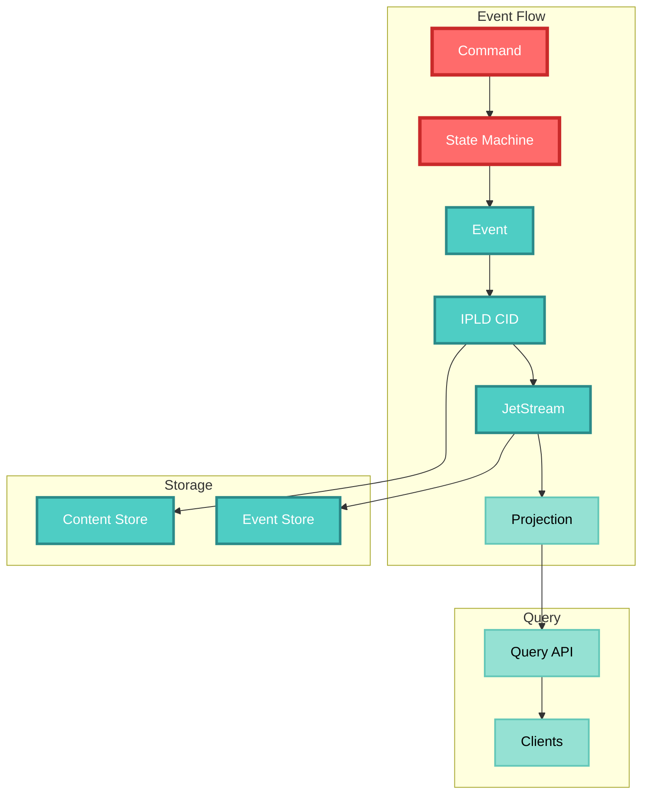
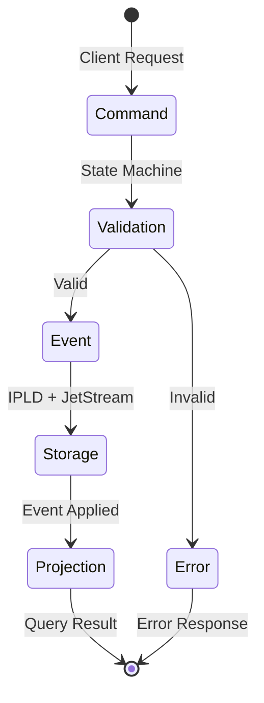

# CIM Graph Event-Driven Refactoring Design

## Executive Summary

This document outlines the refactoring of cim-graph from a mutable graph library to a pure event-driven system following CIM's core principles. This is not an architectural change - it's correcting a fundamental misunderstanding. CIM graphs have ALWAYS been event-driven; this refactoring aligns the implementation with the original design.

## Problem Statement

The initial implementation incorrectly treated graphs as mutable data structures with direct state modifications. This violates CIM's core principles:

1. **Events are the ONLY way to change state** - no direct mutations
2. **IPLD is the heart of storage** - all event payloads get CIDs
3. **NATS JetStream handles persistence** - not in-memory structures
4. **State machines control transitions** - not arbitrary mutations
5. **ECS + DDD principles** - entities are IDs, components are value objects

## Refactoring Goals

1. Remove all direct mutation methods (Graph trait, GraphBuilder, etc.)
2. Replace with event-driven projections (read-only views)
3. Properly integrate IPLD for content-addressed storage
4. Implement proper ECS + DDD patterns
5. Ensure all state transitions go through state machines

## Key Architectural Corrections

### 1. Graph as Aggregate

```rust
// WRONG: Graph as a data structure
pub trait Graph {
    fn add_node(&mut self, node: Node);
    fn remove_node(&mut self, id: &str);
}

// CORRECT: Graph as an aggregate with events
pub struct GraphAggregate {
    aggregate_id: Uuid,  // The graph IS this ID
    // No stored state - state comes from event fold
}
```

### 2. IPLD Integration

```rust
// Event payloads get CIDs
let payload = EventPayload::NodeAdded { ... };
let cid = cim_ipld::generate_cid(&payload);

// CIDs form Merkle DAGs
EventPayload {
    cid: Cid,
    previous: Option<Cid>,  // Links to previous event
    data: EventData,
}

// Entire transaction history referenced by single CID
let root_cid = cid_chain.root();
let events = jetstream.fetch_by_cid(root_cid);
```

### 3. ECS + DDD Pattern

```rust
// Entities are just IDs
type EntityId = String;

// Components are value objects attached via events
HashMap<EntityId, HashMap<ComponentType, Value>>

// Systems are functions composed from queries
fn query_nodes_with_component(projection: &GraphProjection, component: &str) -> Vec<EntityId>

// State = left fold of events
fn build_projection(events: Vec<Event>) -> GraphProjection {
    events.fold(empty_projection, |proj, event| proj.apply(event))
}
```

### 4. State Machine Control

```rust
// All transitions through state machine
impl GraphStateMachine {
    fn validate_command(&self, cmd: Command, state: &Projection) -> Result<()>
    fn handle_command(&self, cmd: Command) -> Result<Vec<Event>>
}
```

## Design Decisions

### 1. Remove These Abstractions
- `Graph` trait (has mutation methods)
- `GraphBuilder` (graphs aren't "built", they're event streams)
- `EventGraph` from petgraph (has mutations)
- All `add_*`, `remove_*`, `update_*` methods

### 2. Add These Abstractions
- `GraphProjection` trait (read-only)
- `GraphAggregate` (just an ID)
- `EventPayload` with proper CID support
- `GraphStateMachine` for transitions
- `ProjectionEngine` for folding events

### 3. Event Schema

```rust
pub struct GraphEvent {
    event_id: Uuid,
    aggregate_id: Uuid,      // The graph
    correlation_id: Uuid,    // Related events
    causation_id: Option<Uuid>, // What caused this
    payload: EventPayload,   // Gets CID'd
}

pub enum EventPayload {
    Ipld(IpldPayload),      // Content-addressed ops
    Context(ContextPayload), // DDD ops
    Workflow(WorkflowPayload), // State machine ops
    Concept(ConceptPayload), // Semantic ops
    Composed(ComposedPayload), // Multi-graph ops
}
```

### 4. Command Processing

```
Command → StateMachine → Validate → Events → JetStream → Projections
                ↑                                    ↓
                └──────── Current State ←────────────┘
```

## Implementation Phases

### Phase 1: Remove Invalid Abstractions
- [x] Delete Graph trait
- [x] Delete GraphBuilder
- [x] Delete EventGraph
- [x] Remove all mutation methods

### Phase 2: Core Event Infrastructure
- [x] Define event schemas with CID support
- [x] Create GraphProjection trait
- [x] Implement aggregate projection
- [x] Add state machine

### Phase 3: IPLD Integration
- [x] CID generation for payloads
- [x] Merkle DAG construction
- [x] CID chain management
- [ ] Integration with cim-ipld

### Phase 4: Graph Type Conversions
- [ ] Convert IpldGraph to projection
- [ ] Convert ContextGraph to projection
- [ ] Convert WorkflowGraph to projection
- [ ] Convert ConceptGraph to projection
- [ ] Convert ComposedGraph to projection

### Phase 5: System Functions
- [x] Query systems (entity/component queries)
- [x] Command handlers
- [ ] Event handlers
- [ ] Projection builders for each type

### Phase 6: NATS Integration
- [ ] JetStream event persistence
- [ ] Subject algebra from cim-domain subject module
- [ ] Event replay/catchup
- [ ] Collaborative subscriptions

## Migration Guide

### For Graph Creation
```rust
// OLD
let mut graph = GraphBuilder::new()
    .graph_type(GraphType::Ipld)
    .build()?;
graph.add_node(node);

// NEW
let aggregate_id = Uuid::new_v4();
let cmd = GraphCommand::InitializeGraph {
    aggregate_id,
    graph_type: "ipld",
    correlation_id,
};
let events = state_machine.handle(cmd)?;
jetstream.publish(events);
```

### For Graph Queries
```rust
// OLD
let node = graph.get_node("id")?;

// NEW
let projection = build_projection(jetstream.fetch_events(aggregate_id));
let components = get_entity_components(&projection, "id");
```

### For Graph Updates
```rust
// OLD
graph.add_edge(edge);

// NEW
let cmd = GraphCommand::Ipld {
    aggregate_id,
    correlation_id,
    command: IpldCommand::LinkCids { ... }
};
let events = state_machine.handle(cmd)?;
jetstream.publish(events);
```

## Success Criteria

1. **Zero mutations** - All graph changes via events only
2. **CID integration** - All payloads get CIDs, form Merkle DAGs
3. **Pure projections** - Graphs are read-only views
4. **State machine control** - All transitions validated
5. **ECS compliance** - Entities as IDs, components as values
6. **NATS ready** - Events structured for JetStream
7. **Collaborative** - Multiple clients can share event streams

## Risks and Mitigations

| Risk | Impact | Mitigation |
|------|--------|------------|
| Breaking API changes | High | Provide compatibility layer during transition |
| Performance concerns | Medium | Projection caching, efficient fold algorithms |
| Learning curve | Medium | Comprehensive examples and documentation |
| Integration complexity | Low | Clear integration points with cim-ipld, cim-domain subject module |

## Timeline

- Week 1: Design approval and planning
- Week 2: Core refactoring (remove mutations, add projections)
- Week 3: IPLD integration and CID chains
- Week 4: Graph type conversions
- Week 5: NATS integration
- Week 6: Testing and documentation

## Conclusion

This refactoring corrects the fundamental misunderstanding that graphs are mutable data structures. In CIM, graphs have ALWAYS been event-driven projections. This design brings the implementation in line with CIM's core principles and enables the full power of event sourcing, IPLD content addressing, and collaborative graph editing.

## Visual Architecture




