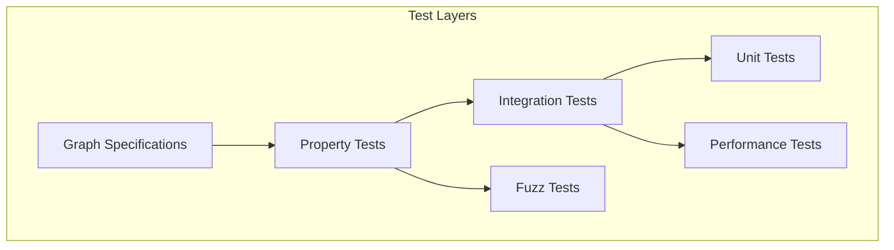
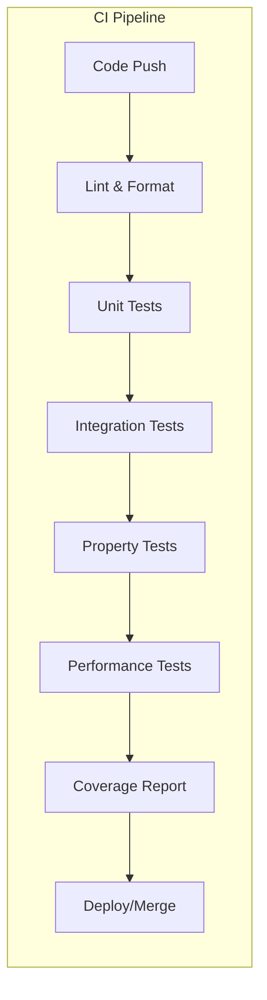

# CIM Graph Test Strategy

## Overview

This document defines the comprehensive testing strategy for the CIM Graph library, ensuring quality through graph-based specifications, automated testing, and continuous validation.

## Testing Philosophy

Our testing approach treats tests as first-class graphs that:
- **Document** expected behavior through graph structures
- **Validate** implementation against specifications
- **Generate** test cases from graph patterns
- **Visualize** test coverage and results

## Test Architecture

### Graph-Based Test Specification

```rust
struct TestSpecification {
    test_graph: Graph<TestNode, TestEdge>,
    invariants: Vec<Invariant>,
    properties: Vec<Property>,
    coverage_requirements: CoverageSpec,
}

struct TestNode {
    id: String,
    node_type: TestNodeType,
    preconditions: Vec<Condition>,
    postconditions: Vec<Condition>,
}

enum TestNodeType {
    Setup,
    Action,
    Assertion,
    Teardown,
}
```

### Test Layers



## Test Categories

### 1. Unit Tests

**Purpose**: Validate individual graph operations

```graph
UnitTestGraph {
    nodes: [
        { id: "setup", type: "Setup", action: "create_empty_graph" },
        { id: "test", type: "Action", action: "add_node" },
        { id: "assert", type: "Assertion", check: "node_exists" }
    ],
    edges: [
        { from: "setup", to: "test" },
        { from: "test", to: "assert" }
    ]
}
```

**Coverage Requirements**:
- All public API methods
- Edge cases and error conditions
- Type safety validation
- Resource management

### 2. Integration Tests

**Purpose**: Validate complex workflows and interactions

```graph
IntegrationTestGraph {
    test_scenarios: [
        "Create graph → Add nodes → Connect edges → Query paths",
        "Load graph → Transform type → Compose → Serialize",
        "Import data → Validate → Process → Export"
    ],
    cross_component_validation: true
}
```

**Focus Areas**:
- Multi-step operations
- Cross-graph composition
- Type transformations
- Serialization round-trips

### 3. Property-Based Tests

**Purpose**: Validate graph invariants and mathematical properties

```rust
property_test! {
    // Graph operations preserve node count
    fn prop_node_count_preserved(graph: Graph, ops: Vec<Operation>) {
        let initial_count = graph.node_count();
        let final_graph = apply_operations(graph, ops);
        let added = count_add_operations(ops);
        let removed = count_remove_operations(ops);
        
        assert_eq!(
            final_graph.node_count(),
            initial_count + added - removed
        );
    }
    
    // Composition is associative
    fn prop_composition_associative(g1: Graph, g2: Graph, g3: Graph) {
        let comp1 = (g1.compose(&g2)).compose(&g3);
        let comp2 = g1.compose(&g2.compose(&g3));
        
        assert_graph_isomorphic(&comp1, &comp2);
    }
}
```

**Properties to Test**:
- Algebraic properties (associativity, commutativity where applicable)
- Invariant preservation
- Referential transparency
- Idempotence of operations

### 4. Performance Tests

**Purpose**: Ensure operations meet performance requirements

```graph
PerformanceTestGraph {
    benchmarks: [
        {
            operation: "add_node",
            complexity: "O(1)",
            max_time_ms: 1,
            test_sizes: [100, 1000, 10000]
        },
        {
            operation: "shortest_path",
            complexity: "O((V + E) log V)",
            max_time_ms: 100,
            test_sizes: [100, 1000, 10000]
        }
    ]
}
```

**Metrics**:
- Operation latency
- Memory allocation
- Scalability curves
- Resource utilization

### 5. Fuzz Tests

**Purpose**: Discover edge cases through randomized testing

```rust
fuzz_target!(|data: &[u8]| {
    if let Ok(ops) = parse_operations(data) {
        let mut graph = Graph::new();
        
        for op in ops {
            // Graph should never panic
            let _ = graph.apply_operation(op);
            
            // Invariants should always hold
            assert!(graph.validate_invariants());
        }
    }
});
```

**Target Areas**:
- Parser robustness
- Memory safety
- Panic prevention
- Data corruption resistance

### 6. Acceptance Tests

**Purpose**: Validate user stories through executable specifications

(See `acceptance-tests.md` for detailed specifications)

## Test Data Generation

### Graph Generators

```rust
trait GraphGenerator {
    fn generate_random(&self, size: usize) -> Graph;
    fn generate_pattern(&self, pattern: GraphPattern) -> Graph;
    fn generate_pathological(&self, case: PathologicalCase) -> Graph;
}

enum GraphPattern {
    Complete,
    Bipartite,
    Tree,
    Cycle,
    DAG,
    SmallWorld,
    ScaleFree,
}

enum PathologicalCase {
    MaxDegree,
    DeepNesting,
    LargeCycle,
    Disconnected,
    Dense,
}
```

### Test Data Categories

1. **Synthetic Graphs**: Generated patterns for specific test cases
2. **Real-World Graphs**: Samples from actual use cases
3. **Adversarial Graphs**: Designed to stress test the system
4. **Golden Graphs**: Known-good examples for regression testing

## Test Execution Strategy

### Continuous Integration Pipeline



### Test Phases

1. **Pre-commit**: Fast unit tests (<1s)
2. **Pull Request**: Full test suite (<5m)
3. **Nightly**: Extended tests including fuzz
4. **Release**: Complete validation including performance

### Test Environment

```yaml
test_matrix:
  rust_versions: ["stable", "nightly"]
  operating_systems: ["ubuntu-latest", "macos-latest", "windows-latest"]
  graph_sizes: ["small", "medium", "large"]
  feature_flags: ["default", "all", "minimal"]
```

## Coverage Requirements

### Code Coverage

- **Minimum**: 80% line coverage
- **Target**: 95% line coverage
- **Required**: 100% coverage for safety-critical paths

### Graph Pattern Coverage

```graph
PatternCoverageGraph {
    patterns_tested: [
        "Empty graphs",
        "Single node",
        "Linear chains",
        "Trees",
        "Cycles",
        "Complete graphs",
        "Disconnected components",
        "Self-loops",
        "Multi-edges"
    ],
    coverage_metric: "percentage_of_patterns_tested"
}
```

### API Surface Coverage

- All public methods tested
- All error conditions handled
- All type combinations validated
- All feature flag combinations tested

## Test Organization

### Directory Structure

```
tests/
├── unit/
│   ├── nodes/
│   ├── edges/
│   ├── queries/
│   └── serialization/
├── integration/
│   ├── workflows/
│   ├── composition/
│   └── transformation/
├── property/
│   ├── invariants/
│   └── algebras/
├── performance/
│   ├── benchmarks/
│   └── profiling/
├── fuzz/
│   └── targets/
└── fixtures/
    ├── graphs/
    └── data/
```

### Test Naming Convention

```rust
#[test]
fn test_<category>_<component>_<scenario>_<expected_outcome>() {
    // Example: test_unit_node_add_with_duplicate_id_returns_error
}
```

## Test Utilities

### Graph Assertion Library

```rust
// Custom assertions for graph testing
assert_graph_equal!(graph1, graph2);
assert_graph_isomorphic!(graph1, graph2);
assert_has_path!(graph, from, to);
assert_is_acyclic!(graph);
assert_satisfies_invariant!(graph, invariant);
```

### Test Graph Builders

```rust
let test_graph = GraphBuilder::new()
    .with_nodes(vec!["A", "B", "C"])
    .with_edges(vec![("A", "B"), ("B", "C")])
    .with_constraint(Constraint::Acyclic)
    .build();
```

## Monitoring and Reporting

### Test Metrics

1. **Execution Time**: Track test duration trends
2. **Flakiness**: Identify unreliable tests
3. **Coverage Delta**: Monitor coverage changes
4. **Failure Patterns**: Analyze common failure modes

### Test Reports

```graph
TestReportGraph {
    report_types: [
        "Coverage Report",
        "Performance Report",
        "Failure Analysis",
        "Trend Analysis"
    ],
    visualization: "Graph-based test flow diagrams",
    alerts: "Regression notifications"
}
```

## Test Maintenance

### Test Debt Management

- Regular test refactoring sprints
- Deprecation of obsolete tests
- Consolidation of duplicate tests
- Performance optimization of slow tests

### Test Documentation

- Each test includes purpose documentation
- Complex tests have inline explanations
- Test patterns documented in wiki
- Failure investigation guides

## Success Criteria

1. **No Regressions**: All tests pass before merge
2. **Fast Feedback**: Test results within 5 minutes
3. **Clear Failures**: Descriptive error messages
4. **Maintainable**: Tests are easy to understand and modify
5. **Comprehensive**: All user scenarios covered

## Next Steps

1. Set up CI/CD pipeline with test stages
2. Implement graph assertion library
3. Create test data generators
4. Establish performance baselines
5. Configure coverage tracking