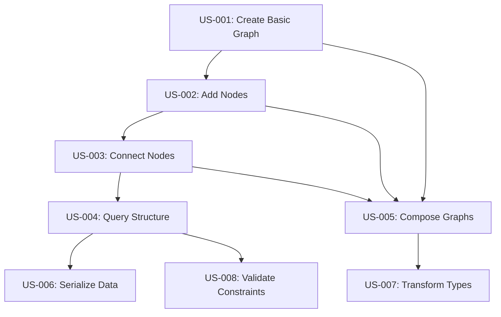

# CIM Graph User Stories

## Overview

This document defines user stories for the CIM Graph library using a graph-based specification format. Each user story is represented as a graph structure that can be directly implemented and validated.

## Story Graph Structure

Each user story follows this graph pattern:

```
UserStory {
    id: String,
    title: String,
    as_a: Actor,
    i_want: Goal,
    so_that: Value,
    acceptance_criteria: Vec<AcceptanceCriterion>,
    dependencies: Vec<StoryId>,
}

AcceptanceCriterion {
    id: String,
    given: Context,
    when: Action,
    then: Outcome,
    validation_graph: Graph,
}
```

## Core User Stories

### US-001: Create Basic Graph

```graph
UserStory {
    id: "US-001",
    title: "Create Basic Graph",
    as_a: Developer,
    i_want: "to create a new graph instance",
    so_that: "I can model relationships between entities",
    acceptance_criteria: [
        {
            id: "AC-001-1",
            given: "no existing graph",
            when: "I create a new graph",
            then: "an empty graph is initialized",
            validation_graph: {
                nodes: [],
                edges: [],
                metadata: { created: timestamp }
            }
        },
        {
            id: "AC-001-2",
            given: "a graph type specification",
            when: "I create a typed graph",
            then: "the graph enforces type constraints",
            validation_graph: {
                type: "IpldGraph | ContextGraph | WorkflowGraph | ConceptGraph",
                constraints: { node_type: Type, edge_type: Type }
            }
        }
    ],
    dependencies: []
}
```

### US-002: Add Nodes to Graph

```graph
UserStory {
    id: "US-002",
    title: "Add Nodes to Graph",
    as_a: Developer,
    i_want: "to add nodes to a graph",
    so_that: "I can represent entities in the graph",
    acceptance_criteria: [
        {
            id: "AC-002-1",
            given: "an empty graph",
            when: "I add a node",
            then: "the node is stored with a unique ID",
            validation_graph: {
                before: { nodes: [], edges: [] },
                action: "add_node(data)",
                after: { nodes: [{ id: NodeId, data: data }], edges: [] }
            }
        },
        {
            id: "AC-002-2",
            given: "a typed graph",
            when: "I add a node with invalid type",
            then: "the operation fails with type error",
            validation_graph: {
                graph_type: "IpldGraph",
                node_type: "String",
                action: "add_node(123)",
                result: "Error::TypeMismatch"
            }
        }
    ],
    dependencies: ["US-001"]
}
```

### US-003: Connect Nodes with Edges

```graph
UserStory {
    id: "US-003",
    title: "Connect Nodes with Edges",
    as_a: Developer,
    i_want: "to create edges between nodes",
    so_that: "I can model relationships",
    acceptance_criteria: [
        {
            id: "AC-003-1",
            given: "a graph with two nodes",
            when: "I create an edge between them",
            then: "the nodes are connected",
            validation_graph: {
                before: { 
                    nodes: [{ id: "A" }, { id: "B" }],
                    edges: []
                },
                action: "add_edge('A', 'B', edge_data)",
                after: {
                    nodes: [{ id: "A" }, { id: "B" }],
                    edges: [{ from: "A", to: "B", data: edge_data }]
                }
            }
        },
        {
            id: "AC-003-2",
            given: "a directed graph",
            when: "I query edges",
            then: "direction is preserved",
            validation_graph: {
                edges: [{ from: "A", to: "B" }],
                query: "edges_from('A')",
                result: [{ to: "B" }],
                query2: "edges_from('B')",
                result2: []
            }
        }
    ],
    dependencies: ["US-002"]
}
```

### US-004: Query Graph Structure

```graph
UserStory {
    id: "US-004",
    title: "Query Graph Structure",
    as_a: Developer,
    i_want: "to query graph topology",
    so_that: "I can analyze relationships",
    acceptance_criteria: [
        {
            id: "AC-004-1",
            given: "a populated graph",
            when: "I query neighbors of a node",
            then: "all connected nodes are returned",
            validation_graph: {
                structure: {
                    nodes: ["A", "B", "C", "D"],
                    edges: [
                        { from: "A", to: "B" },
                        { from: "A", to: "C" },
                        { from: "B", to: "D" }
                    ]
                },
                query: "neighbors('A')",
                result: ["B", "C"]
            }
        },
        {
            id: "AC-004-2",
            given: "a graph with cycles",
            when: "I check for cycles",
            then: "cycles are detected",
            validation_graph: {
                structure: {
                    edges: [
                        { from: "A", to: "B" },
                        { from: "B", to: "C" },
                        { from: "C", to: "A" }
                    ]
                },
                query: "has_cycles()",
                result: true,
                cycle_path: ["A", "B", "C", "A"]
            }
        }
    ],
    dependencies: ["US-003"]
}
```

### US-005: Compose Multiple Graphs

```graph
UserStory {
    id: "US-005",
    title: "Compose Multiple Graphs",
    as_a: Developer,
    i_want: "to combine different graph types",
    so_that: "I can model cross-domain relationships",
    acceptance_criteria: [
        {
            id: "AC-005-1",
            given: "an IPLD graph and a Context graph",
            when: "I compose them",
            then: "a unified graph is created with mappings",
            validation_graph: {
                graph1: {
                    type: "IpldGraph",
                    nodes: [{ id: "cid1", type: "Cid" }]
                },
                graph2: {
                    type: "ContextGraph",
                    nodes: [{ id: "addr1", type: "Address" }]
                },
                action: "compose(graph1, graph2, mappings)",
                result: {
                    type: "ComposedGraph",
                    graphs: ["IpldGraph", "ContextGraph"],
                    mappings: [{ from: "cid1", to: "addr1", type: "references" }]
                }
            }
        }
    ],
    dependencies: ["US-001", "US-002", "US-003"]
}
```

### US-006: Serialize Graph Data

```graph
UserStory {
    id: "US-006",
    title: "Serialize Graph Data",
    as_a: Developer,
    i_want: "to serialize graphs to different formats",
    so_that: "I can persist and share graph data",
    acceptance_criteria: [
        {
            id: "AC-006-1",
            given: "a populated graph",
            when: "I serialize to JSON",
            then: "valid JSON is produced",
            validation_graph: {
                graph: {
                    nodes: [{ id: "A", data: "value" }],
                    edges: [{ from: "A", to: "B" }]
                },
                action: "to_json()",
                result: {
                    type: "object",
                    properties: {
                        nodes: "array",
                        edges: "array",
                        metadata: "object"
                    }
                }
            }
        },
        {
            id: "AC-006-2",
            given: "a graph with Nix compatibility",
            when: "I serialize to Nix",
            then: "valid Nix expression is produced",
            validation_graph: {
                action: "to_nix()",
                result_pattern: "{ nodes = [...]; edges = [...]; }"
            }
        }
    ],
    dependencies: ["US-004"]
}
```

### US-007: Transform Graph Types

```graph
UserStory {
    id: "US-007",
    title: "Transform Graph Types",
    as_a: Developer,
    i_want: "to convert between graph types",
    so_that: "I can use graphs in different contexts",
    acceptance_criteria: [
        {
            id: "AC-007-1",
            given: "a WorkflowGraph",
            when: "I transform to ConceptGraph",
            then: "semantic relationships are preserved",
            validation_graph: {
                source: {
                    type: "WorkflowGraph",
                    nodes: [{ id: "state1", type: "WorkflowState" }],
                    edges: [{ type: "Event", data: "transition" }]
                },
                transform: "to_concept_graph()",
                result: {
                    type: "ConceptGraph",
                    nodes: [{ id: "concept1", type: "Concept", derived_from: "state1" }],
                    edges: [{ type: "SemanticRelation", meaning: "causes" }]
                }
            }
        }
    ],
    dependencies: ["US-005"]
}
```

### US-008: Validate Graph Constraints

```graph
UserStory {
    id: "US-008",
    title: "Validate Graph Constraints",
    as_a: Developer,
    i_want: "to validate graph structure and data",
    so_that: "I can ensure graph integrity",
    acceptance_criteria: [
        {
            id: "AC-008-1",
            given: "a graph with constraints",
            when: "I validate the graph",
            then: "constraint violations are reported",
            validation_graph: {
                constraints: {
                    max_degree: 3,
                    acyclic: true,
                    node_validator: "fn(node) -> bool"
                },
                graph: {
                    nodes: ["A", "B", "C"],
                    edges: [
                        { from: "A", to: "B" },
                        { from: "B", to: "C" },
                        { from: "C", to: "A" }
                    ]
                },
                validation_result: {
                    valid: false,
                    violations: ["cycle detected: A->B->C->A"]
                }
            }
        }
    ],
    dependencies: ["US-004"]
}
```

## Graph-Based Testing Strategy

Each acceptance criterion contains a `validation_graph` that serves as both documentation and executable test specification. These graphs can be:

1. **Directly executed** as integration tests
2. **Used to generate** unit test cases
3. **Validated against** actual implementation
4. **Visualized** for documentation

## Story Dependencies Graph



## Implementation Priority

1. **Core Operations** (US-001 to US-004): Basic graph functionality
2. **Composition** (US-005): Cross-domain integration
3. **Serialization** (US-006): Data persistence
4. **Advanced Features** (US-007, US-008): Type transformation and validation

## Next Steps

1. Generate acceptance test specifications from these user stories
2. Create test harness that can execute validation graphs
3. Implement graph types according to priority order
4. Validate implementation against acceptance criteria