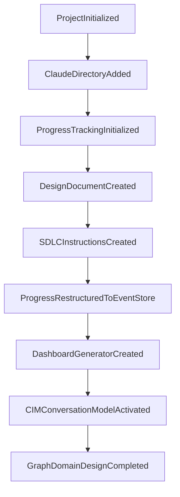

# CIM Graph - Progress Dashboard

> Auto-generated from EventStore (`progress.json`) - DO NOT EDIT MANUALLY

## 📊 Project Overview

**Project**: cim-graph
**Description**: Unified graph abstraction library consolidating all graph operations across the CIM ecosystem
**Current Phase**: **DESIGN**
**Last Updated**: 2025-08-03T10:30:00-07:00

## 📈 Metrics

| Metric | Value |
|--------|-------|
| Total Events | 9 |
| Git Commits | 4 |
| Current Phase | DESIGN |

## 🎯 Phase Progress

- **INITIALIZE**: 100% complete
- **DESIGN**: 100% complete

## 📋 Current Phase Requirements (DESIGN)

### ✅ Completed
- [x] design_document
- [x] sdlc_instructions
- [x] eventstore_pattern
- [x] conceptual_model
- [x] domain_events
- [x] trait_system
- [x] api_specification
- [x] architecture_diagrams

### ⏳ Remaining
- [ ] architecture_diagrams
- [ ] domain_model
- [ ] event_flows
- [ ] api_specifications

## 🔄 Recent Events

| Timestamp | Event | Phase | Commit |
|-----------|-------|-------|--------|
| 2025-08-03 | GraphDomainDesignCompleted | DESIGN | d633a8d |
| 2025-08-03 | CIMConversationModelActivated | DESIGN | null |
| 2025-08-03 | DashboardGeneratorCreated | DESIGN | 14a97ec |
| 2025-08-03 | ProgressRestructuredToEventStore | DESIGN | 50db5e1 |
| 2025-08-03 | SDLCInstructionsCreated | DESIGN | f24f824 |

## 📁 Artifacts Created

- `.claude/`
- `doc/progress/progress.json`
- `doc/design/cim-graph-design.md`
- `readme.md`

## 📅 Event Timeline

```mermaid
gantt
    title Project Event Timeline
    dateFormat YYYY-MM-DD
    section Events
    ProjectInitialized : 2025-08-03
    ClaudeDirectoryAdded : 2025-08-03
    ProgressTrackingInitialized : 2025-08-03
    DesignDocumentCreated : 2025-08-03
    SDLCInstructionsCreated : 2025-08-03
    ProgressRestructuredToEventStore : 2025-08-03
    DashboardGeneratorCreated : 2025-08-03
    CIMConversationModelActivated : 2025-08-03
    GraphDomainDesignCompleted : 2025-08-03
```

## 🔗 Event Causation Chain



## 📊 Statistics by Phase

| Phase | Event Count |
|-------|-------------|
| INITIALIZE | 3 |
| DESIGN | 6 |

---

_Generated on: 2025-08-03_
